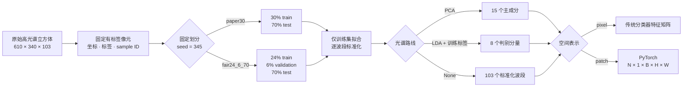

<div align="center">

# 🌈 高光谱智能图像解译

### Reproducible Hyperspectral Image Classification Pipeline

面向课程复现、模型比较与后续研究的可配置 PyTorch 高光谱数据基座


[快速开始](#-快速开始) · [配置调参](#️-配置调参) · [项目结构](#-项目结构) · [文档导航](#-文档导航)

</div>

<p align="center">
  
</p>

## 项目简介

本项目以 Pavia University 为首个闭环数据集，建立可复现、无数据泄漏、可扩展的高光谱图像分类工程。当前重点是把固定数据划分、统计预处理、空间邻域与 PyTorch 数据接口做成所有模型共享的实验基座，随后再复现 HybridSN，并开展改进、消融和多模型比较。

> [!IMPORTANT]
> 当前已经完成环境、数据审计、固定划分和 PCA/LDA 数据管线，但尚未开始正式 HybridSN 训练。仓库中没有可冒充本项目结果的第三方预训练权重，也没有尚未产生的 OA、AA 或 Kappa 指标。

## ✨ 当前成果

| 模块 | 状态 | 已验收内容 |
|---|:---:|---|
| GPU 环境 | ✅ | Python 3.12.13、PyTorch 2.12.1+cu130、RTX 5070 前反向通过 |
| 数据审计 | ✅ | Pavia University、Indian Pines、Salinas 文件与类别统计 |
| 固定划分 | ✅ | `paper30` 与 `fair24_6_70`，seed=345，逐样本坐标与标签可追溯 |
| 光谱处理 | ✅ | 训练集专用标准化、PCA15、监督式 LDA8、原始 103 波段路线 |
| 空间表示 | ✅ | `pixel` 与动态 `patch25`，边界填充和身份字段完整 |
| PyTorch 接口 | ✅ | Dataset/DataLoader、可复现 shuffle、中英双语 Notebook |
| 自动验收 | ✅ | 48 项测试通过，PCA/LDA 冻结状态重建一致 |
| HybridSN 基线 | ⏳ | 下一阶段：模型定义、shape 与参数量测试 |

## 🧩 数据处理管线



所有路线共享相同的 `sample_index`、二维坐标、原始标签和固定测试集。标准化与 PCA 只使用训练光谱拟合；LDA 只额外读取训练标签；验证集与测试集只执行 `transform`。

## 🚀 快速开始

### 1. 克隆并创建环境

```powershell
git clone <你的仓库地址>
cd <仓库目录>

py -3.12 -m venv .venv
.\.venv\Scripts\python.exe -m pip install --upgrade pip
.\.venv\Scripts\python.exe -m pip install torch==2.12.1 `
  --index-url https://download.pytorch.org/whl/cu130
.\.venv\Scripts\python.exe -m pip install -r requirements.txt
```

如果显卡或 CUDA 环境不同，请先按 PyTorch 官方方式选择适合本机的构建，不要复制提交别人的 `.venv`。

### 2. 准备原始数据

原始 `.mat` 不进入 Git。至少将以下文件放入 `data/raw/`：

```text
PaviaU.mat
PaviaU_gt.mat
```

文件约定、来源清单与校验信息见 [data/raw/README.md](data/raw/README.md) 和 [data/raw/SOURCES.csv](data/raw/SOURCES.csv)。

### 3. 验证工程

```powershell
.\.venv\Scripts\python.exe scripts\检查运行环境.py
.\.venv\Scripts\python.exe -m pytest -q
.\.venv\Scripts\python.exe scripts\检查配置.py `
  --config "configs\数据预处理\Pavia数据预处理.yaml" `
  --require-state
```

### 4. 分步运行数据管线

```powershell
.\.venv\Scripts\python.exe scripts\运行数据预处理.py
```

也可以打开 [高光谱数据预处理主流程.ipynb](notebooks/高光谱数据预处理主流程.ipynb)，选择 `.venv` 内核后逐格查看类别构成、空间划分、光谱统计、PCA/LDA 特征、patch 与 batch。

## ⚙️ 配置调参

日常只编辑一份配置：

```text
configs/数据预处理/Pavia数据预处理.yaml
```

三个选择字段决定主要数据路线：

```yaml
dataset:
  split_protocol: fair24_6_70  # paper30 / fair24_6_70

spectral_preprocessing:
  reducer: pca                 # pca / lda / none

spatial_preprocessing:
  representation: patch       # patch / pixel
```

- 论文兼容复现：`paper30 + pca + patch`；
- 公平调参与模型比较：`fair24_6_70 + pca/lda/none + patch/pixel`；
- 修改 batch size、loader seed 或 worker 不需要新建统计预处理状态；
- 切换 split、reducer、分量数或空间表示时，必须使用对应的独立冻结状态。

参数含义与状态生成边界见 [配置调参说明](configs/数据预处理/配置调参说明.md)。

## 📁 项目结构

```text
├─ configs/       唯一数据 YAML 与阶段 3 模型配置模板
├─ data/          数据说明、固定 split 和小型冻结预处理状态
├─ src/           数据、模型、训练、评价与可视化模块
├─ scripts/       环境检查、配置检查、只读主流程与受控维护入口
├─ tests/         固定划分、PCA/LDA、Dataset/DataLoader 和配置测试
├─ notebooks/     唯一数据预处理学习与可视化 Notebook
├─ docs/          实施报告、论文草稿、协议、任务看板和开发接口
├─ results/       已审核的数据概览图与统计表
├─ experiments/   后续正式实验配置副本（运行内容默认不提交）
└─ 归档/           仅保留公开复现需要的历史配置预设
```

## 🧭 研究路线

- [x] 独立 GPU PyTorch 环境与可复现性工具
- [x] 三套高光谱数据审计
- [x] Pavia 两套固定划分协议
- [x] 标准化、PCA15、LDA8、pixel/patch 统一接口
- [x] 冻结状态、Notebook、自动测试和 GitHub 提交边界
- [ ] HybridSN 模型定义、shape 与参数量测试
- [ ] `paper30` 论文兼容基线与 `fair24_6_70` 公平调参
- [ ] HybridSN 改进模块与消融实验
- [ ] 其他模型和多数据集比较
- [ ] 论文结果、答辩图表与最终工程包

## 📚 文档导航

| 文档 | 用途 |
|---|---|
| [使用说明](使用说明.md) | Windows 环境、命令和逐步操作 |
| [配置调参说明](configs/数据预处理/配置调参说明.md) | 唯一 YAML 的字段与路线组合 |
| [数据预处理接口](docs/数据预处理接口说明.md) | Python API、张量契约和扩展规则 |
| [实验协议](docs/EXPERIMENT_PROTOCOL.md) | 数据泄漏、调参、测试集与报告红线 |
| [任务看板](docs/TASK_BOARD.md) | 当前完成度与下一步任务 |
| [实施报告](docs/solution_report/高光谱智能解译大作业实施报告.md) | 工程过程、验收证据和课程对应关系 |
| [研究论文草稿](docs/paper/高光谱图像分类研究论文.md) | 当前方法章节与后续结果占位 |
| [决策记录](docs/notes/DECISIONS.md) | 关键协议、接口和目录决策 |

## 🤝 参与开发

开始修改前请阅读 [CONTRIBUTING.md](CONTRIBUTING.md)。新增算法应使用独立分支，同时补充测试、配置和必要文档；不得重新生成 seed=345 的固定划分，不得使用测试集调参，也不得把临时网络或第三方模型结果写入正式结果表。

---

<div align="center">

**当前里程碑：数据管线已就绪，下一站是 HybridSN 基线。**

</div>
