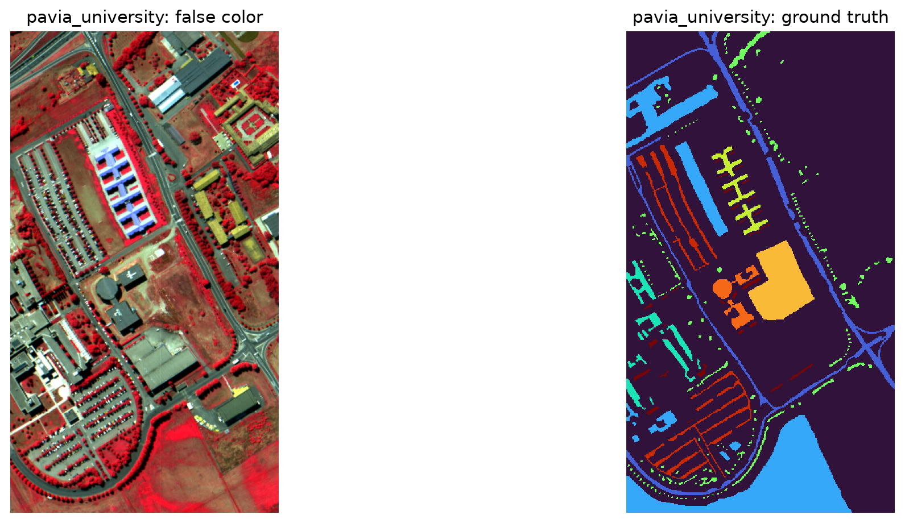
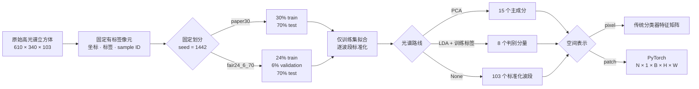

<div align="center">

# 🌈 高光谱智能图像解译

### Reproducible Hyperspectral Image Classification Pipeline

可复现、可审计、可扩展的 PyTorch 高光谱图像分类工程，覆盖 HybridSN 基线、模型改进与多种传统方法对比。


[快速开始](#-快速开始) · [配置调参](#️-配置调参) · [项目结构](#-项目结构) · [文档导航](#-文档导航)

</div>

<p align="center">
  
</p>

## 项目简介

本项目以 Pavia University 为首个闭环数据集，建立可复现、可审计、可扩展的高光谱图像分类工程。工程在统一的数据基座上完成 HybridSN 结构复现、`paper30` 论文兼容基线、`fair24_6_70` 光谱预处理与研究架构分组对比，并完成 **HybridSN 模型改进（BatchNorm + 残差连接 + 全局平均池化）** 及与原始模型的严格控制变量对比。

> [!IMPORTANT]
> 统一 seed=1442 的正式基线：原始 HybridSN 在随机像元 `fair24_6_70` 划分上取得 **OA=99.9532%、AA=99.9405%、Kappa=0.999381**（4,844,793 参数，14 误分）。改进 HybridSN（BN+残差+GAP）以 **约 97% 的参数削减（4,844,793 → 152,073）** 换取 OA=99.7328%、AA=99.3404%、Kappa=0.996459。空间审计显示测试 patch 与训练中心像元高度重叠，因此这些数字是课程/论文兼容口径的精度，不能直接解释为严格跨区域泛化能力。

## ✨ 当前成果

| 模块 | 状态 | 已验收内容 |
|---|:---:|---|
| GPU 环境 | ✅ | Python 3.12.13、PyTorch 2.12.1+cu130、RTX 5070 前反向通过 |
| 数据审计 | ✅ | Pavia University、Indian Pines、Salinas 文件与类别统计 |
| 固定划分 | ✅ | `paper30` 与 `fair24_6_70`，seed=1442，逐样本坐标与标签可追溯 |
| 光谱处理 | ✅ | 训练集专用标准化、PCA15、监督式 LDA8、原始 103 波段路线 |
| 空间表示 | ✅ | `pixel` 与动态 `patch25`，边界填充和身份字段完整 |
| PyTorch 接口 | ✅ | Dataset/DataLoader、可复现 shuffle、模型就绪数据产物与两阶段 Notebook |
| 自动验收 | ✅ | 全仓测试通过，PCA/LDA 状态、LBP/Gabor 特征与训练/评估接口一致 |
| HybridSN 结构 | ✅ | 原论文 3D→2D 架构、`N×1×15×25×25 → N×9`、4,844,793 个参数、前后向通过 |
| HybridSN 正式实验 | ✅ | seed=1442、OA/AA/Kappa、性能、checkpoint 与四类结果图齐全 |
| 架构分组对比 | ✅ | PCA/LDA/选带、LBP/Gabor、SVM/HistGB 与 HybridSN 共 10 种方法，分类图和性能分析齐全 |
| 改进 HybridSN | ✅ | BatchNorm + 残差连接 + 全局平均池化，152,073 参数（−96.9%），与原始模型控制变量对比 |

## 🧩 数据处理管线



所有路线共享相同的 `sample_index`、二维坐标、原始标签和固定测试集。标准化与 PCA 只使用训练光谱拟合；LDA 只额外读取训练标签；验证集与测试集只执行 `transform`。

## 🚀 快速开始

### 1. 克隆并创建环境

```powershell
git clone https://github.com/TheEtherREAL/hyperspectral-image-classification.git
cd hyperspectral-image-classification

py -3.12 -m venv .venv
.\.venv\Scripts\python.exe -m pip install --upgrade pip
.\.venv\Scripts\python.exe -m pip install torch==2.12.1 `
  --index-url https://download.pytorch.org/whl/cu130
.\.venv\Scripts\python.exe -m pip install -r requirements.txt
```

如果显卡或 CUDA 环境不同，请先按 PyTorch 官方方式选择适合本机的构建，不要复制提交别人的 `.venv`。

### 2. 准备原始数据

原始 `.mat` 不进入 Git。至少将以下文件放入 `data/raw/`：

```text
PaviaU.mat
PaviaU_gt.mat
```

文件约定、来源清单与校验信息见 [data/raw/README.md](data/raw/README.md) 和 [data/raw/SOURCES.csv](data/raw/SOURCES.csv)。

### 3. 验证工程

```powershell
.\.venv\Scripts\python.exe scripts\检查运行环境.py
.\.venv\Scripts\python.exe -m pytest -q
.\.venv\Scripts\python.exe scripts\检查配置.py `
  --config "configs\数据预处理\Pavia数据预处理.yaml" `
  --require-state
```

### 4. 分步运行数据与模型流程

```powershell
.\.venv\Scripts\python.exe scripts\运行数据预处理.py
```

也可以依次打开以下两本 Notebook，并选择 `.venv` 内核：

1. [高光谱数据预处理主流程.ipynb](notebooks/高光谱数据预处理主流程.ipynb)：按 `paper30 + seed1442 + standard + PCA15 + patch25` 读取冻结状态并保存 `model_ready_dataset.npz`；同时对齐参考 `Highspectrum.ipynb`，输出伪彩色/标签叠加、类别统计、训练集波段相关性、PCA–LDA 对照和 patch 图。
2. [HybridSN模型结构学习.ipynb](notebooks/HybridSN模型结构学习.ipynb)：对齐参考 `HybridSN.ipynb` 的模型、训练、测试和分类图流程。`RUN_TRAINING` 与 `RUN_FINAL_TEST` 默认均为 `False`，后续章节直接只读回放已冻结的 100 轮正式运行，展示 OA/AA/Kappa、逐类精度、混淆矩阵、分类图、错误像元、耗时、显存与空间重叠审计。

HybridSN 的唯一模型定义位于 [HybridSN模型.py](src/models/HybridSN模型.py)，Notebook 不复制第二份模型类。
两本 Notebook 的报告级 PNG/CSV 会集中导出到 `results/notebook_outputs/reference_aligned/`；已执行输出也保存在 Notebook 内，可直接查看。

### 5. 一键运行 HybridSN baseline

```powershell
.\.venv\Scripts\python.exe scripts\运行HybridSN基线.py
```

脚本严格校验 `model_ready_dataset.npz` 的协议、seed 与预处理指纹，随后保存配置、环境、逐轮日志、可恢复 checkpoint、OA/AA/Kappa、逐类准确率、训练/推理性能、混淆矩阵、学习曲线、分类图和空间重叠审计。调试时使用 `--epochs 1 --skip-test`，避免提前访问测试集。

### 6. 运行光谱预处理公平对比

```powershell
.\.venv\Scripts\python.exe scripts\运行HybridSN预处理对比.py
```

该实验在 `fair24_6_70` 的训练/验证/测试协议下，以统一 seed=1442、相同 HybridSN、15 个输入通道和 30 epoch 比较标准 PCA、无标准化 PCA、PCA whitening、均匀原始波段和 Fisher 原始波段。标准化 PCA15 的 validation OA 唯一最高（100%），Test OA=99.9532%；无标准化 PCA15 明显下降到 Test OA=94.9773%。正式结果 Notebook 为 [HybridSN预处理方法对比实验.ipynb](notebooks/HybridSN预处理方法对比实验.ipynb)，Word 报告草稿为 [HybridSN预处理对比实验报告草稿.md](docs/solution_report/HybridSN预处理对比实验报告草稿.md)。

### 7. 运行研究架构分组对比

```powershell
.\.venv\Scripts\python.exe scripts\运行研究架构分组对比.py
```

该实验按控制变量方式比较 PCA15/LDA8/均匀选带、LBP/Gabor/融合、RBF-SVM/HistGradientBoosting，并合并相同 `fair24_6_70 + seed1442` 的 HybridSN 结果。PCA15+LBP+Gabor+SVM 的 Test OA=99.9365%，PCA15 HybridSN 为 99.9532%。正式结果见 [研究架构分组对比实验.ipynb](notebooks/研究架构分组对比实验.ipynb)，报告草稿见 [研究架构分组对比实验报告草稿.md](docs/solution_report/研究架构分组对比实验报告草稿.md)。

### 8. 运行改进 HybridSN 对比

```powershell
.\.venv\Scripts\python.exe scripts\运行HybridSN改进对比.py
```

改进模型定义在 [改进HybridSN.py](src/models/改进HybridSN.py)，在原始 HybridSN 基础上做三处改动：每个卷积后加 **BatchNorm**、每个 3D/2D 卷积块加 **残差连接**（通道变化时用投影短接对齐维度）、用 **全局平均池化（GAP）** 替换 `Flatten(18496)→256→128` 的全连接分类头。3D/2D 卷积的通道与卷积核与原始完全一致，从而把比较限定在这三处改动上。脚本在 `fair24_6_70 + seed1442 + PCA15` 上以与基线完全相同的训练协议训练改进模型，并与原始 HybridSN 做控制变量对比，输出整体指标、逐类精度与参数量对比图。

| 模型 | 参数量 | OA | AA | Kappa |
|---|--:|--:|--:|--:|
| 原始 HybridSN | 4,844,793 | 99.9532% | 99.9405% | 0.999381 |
| 改进 HybridSN | 152,073（−96.9%） | 99.7328% | 99.3404% | 0.996459 |

改进模型以约 97% 的参数削减换取 0.22pp OA 下降，误差集中在少数类 Trees 与 Shadows（GAP 头丢失细粒度空间纹理）。改进的价值在于模型体积/内存压缩（18.48 MiB → 0.58 MiB）与抗过拟合，预期在更难的多类别数据集上相对优势更明显。

## ⚙️ 配置调参

日常只编辑一份配置：

```text
configs/数据预处理/Pavia数据预处理.yaml
```

三个选择字段决定主要数据路线：

```yaml
dataset:
  split_protocol: fair24_6_70  # paper30 / fair24_6_70

spectral_preprocessing:
  reducer: pca                 # pca / lda / none

spatial_preprocessing:
  representation: patch       # patch / pixel
```

- 论文兼容复现：`paper30 + pca + patch`；
- 公平调参与模型比较：`fair24_6_70 + pca/lda/none + patch/pixel`；
- 修改 batch size、loader seed 或 worker 不需要新建统计预处理状态；
- 切换 split、reducer、分量数或空间表示时，必须使用对应的独立冻结状态。

改进模型的结构开关（`batch_normalization` / `residual_connections` / `dense_units`）在 [configs/模型训练/HybridSN_Pavia改进对比.yaml](configs/模型训练/HybridSN_Pavia改进对比.yaml) 中配置。参数含义与状态生成边界见 [配置调参说明](configs/数据预处理/配置调参说明.md)。

## 📁 项目结构

```text
├─ configs/       唯一数据 YAML 与 HybridSN 论文复现/改进对比配置
├─ data/          数据说明、固定 split 和小型冻结预处理状态
├─ src/           数据、模型（原始 + 改进）、训练、评价与可视化模块
├─ scripts/       环境检查、配置检查、只读主流程与受控维护入口
├─ tests/         数据管线、配置及 HybridSN 结构/前后向测试
├─ notebooks/     交付 Notebook（01/02/03）与数据产物/结构学习 Notebook
├─ docs/          实施报告、论文草稿、协议、任务看板和开发接口
├─ results/       已审核的数据概览图与统计表
├─ experiments/   后续正式实验配置副本（运行内容默认不提交）
├─ report/        实验报告（Markdown）与报告插图（含改进 HybridSN 对比）
└─ 归档/           仅保留公开复现需要的历史配置预设
```

## 🧭 研究路线

- [x] 独立 GPU PyTorch 环境与可复现性工具
- [x] 三套高光谱数据审计
- [x] Pavia 两套固定划分协议
- [x] 标准化、PCA15、LDA8、pixel/patch 统一接口
- [x] 冻结状态、Notebook、自动测试和 GitHub 提交边界
- [x] HybridSN 模型定义、逐层 shape、参数量与前后向测试
- [x] `paper30` 论文兼容 HybridSN 单种子正式基线
- [x] `fair24_6_70 + seed1442` 光谱预处理与研究架构分组对比
- [x] HybridSN 改进模块（BatchNorm + 残差 + GAP）与控制变量对比
- [ ] `fair24_6_70` 多随机种子公平调参与空间块划分对照
- [ ] 改进模型在其他数据集（Indian Pines / Salinas）上的验证
- [ ] 其他模型和多数据集比较
- [ ] 论文结果、答辩图表与最终工程包

## 📚 文档导航

| 文档 | 用途 |
|---|---|
| [使用说明](使用说明.md) | Windows 环境、命令和逐步操作 |
| [配置调参说明](configs/数据预处理/配置调参说明.md) | 唯一 YAML 的字段与路线组合 |
| [数据预处理接口](docs/数据预处理接口说明.md) | Python API、张量契约和扩展规则 |
| [实验协议](docs/EXPERIMENT_PROTOCOL.md) | 数据泄漏、调参、测试集与报告红线 |
| [任务看板](docs/TASK_BOARD.md) | 当前完成度与下一步任务 |
| [实施报告](docs/solution_report/高光谱智能解译大作业实施报告.md) | 工程过程、验收证据和课程对应关系 |
| [实验报告（Markdown）](report/实验报告.md) | 按教师 Word 模板标题组织的完整报告，含基本任务与改进 HybridSN 对比 |
| [HybridSN 基线报告草稿](docs/solution_report/HybridSN基线阶段实验报告草稿.md) | 按教师 Word 模板标题组织的阶段结果、图表与误差分析 |
| [研究架构分组对比报告草稿](docs/solution_report/研究架构分组对比实验报告草稿.md) | 10 种方法的控制变量结果、任务解释、性能分析和改进方向 |
| [研究论文草稿](docs/paper/高光谱图像分类研究论文.md) | 当前方法章节与后续结果占位 |
| [决策记录](docs/notes/DECISIONS.md) | 关键协议、接口和目录决策 |

## 🤝 参与开发

开始修改前请阅读 [CONTRIBUTING.md](CONTRIBUTING.md)。新增算法应使用独立分支，同时补充测试、配置和必要文档；不得重新生成 seed=1442 的固定划分，不得使用测试集调参，也不得把临时网络或第三方模型结果写入正式结果表。

---

<div align="center">

**当前里程碑：HybridSN 基线、光谱预处理对比、研究架构分组对比与改进 HybridSN（BN+残差+GAP）均已闭环；下一步进入多随机种子公平调参、空间划分对照与多数据集验证。**

</div>
