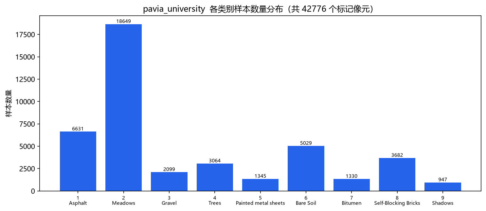
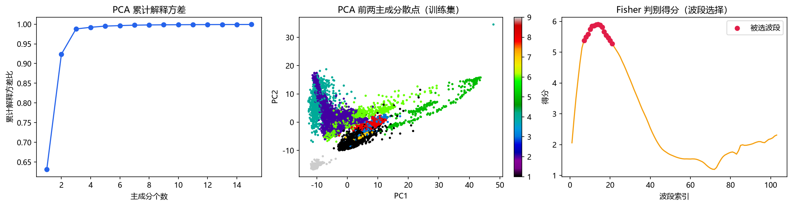
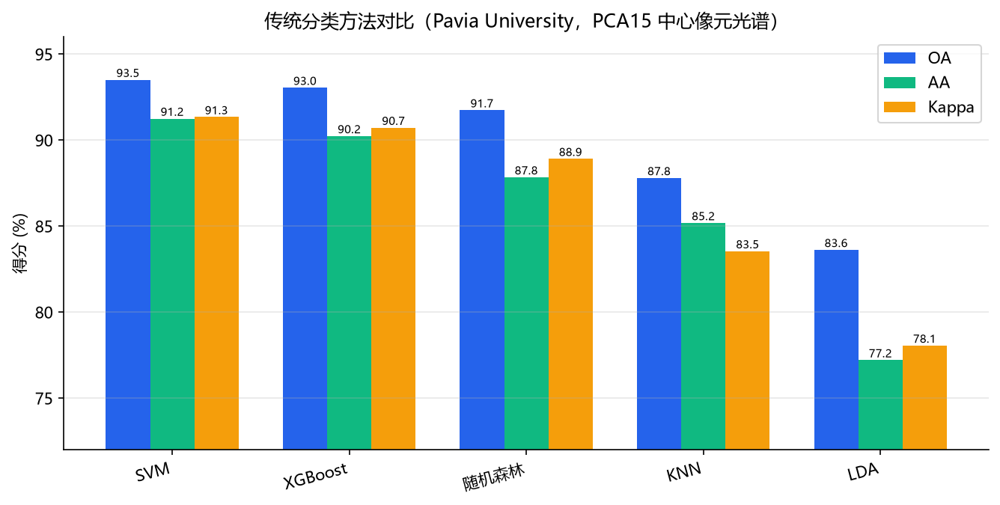
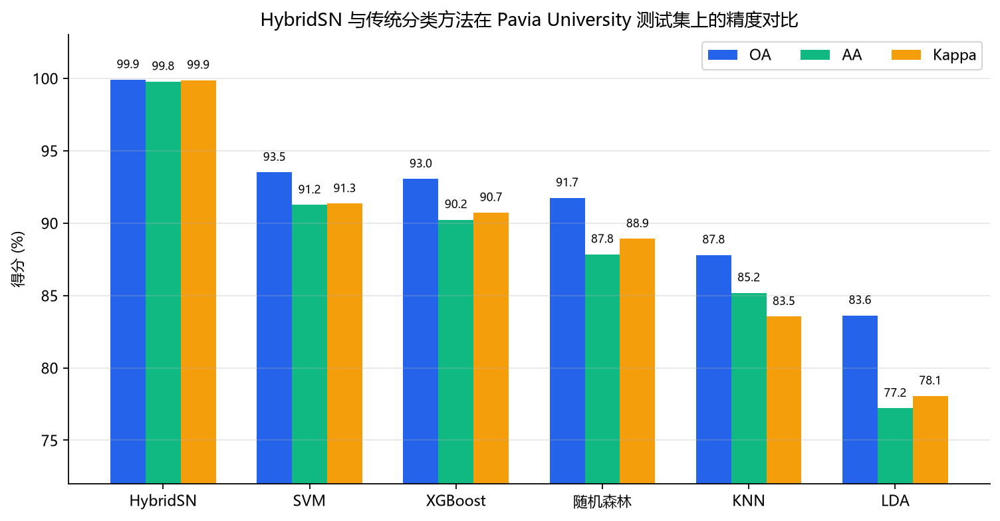
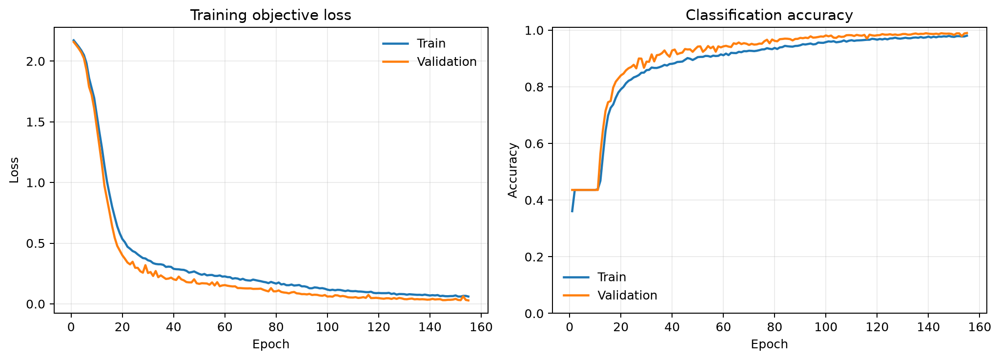
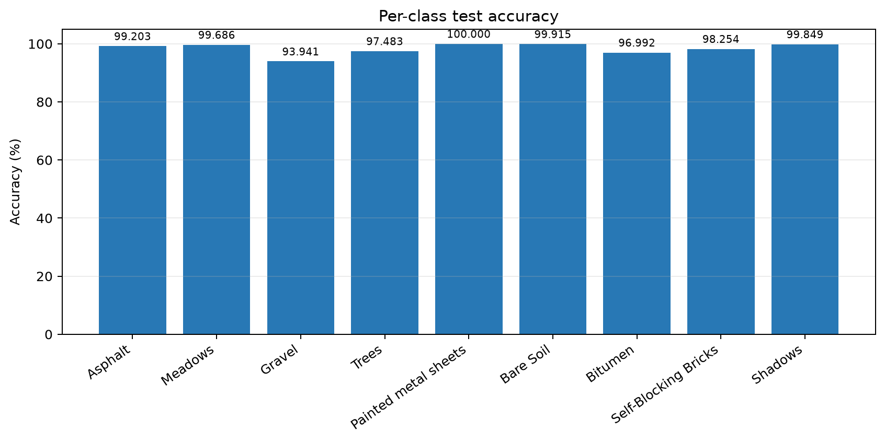
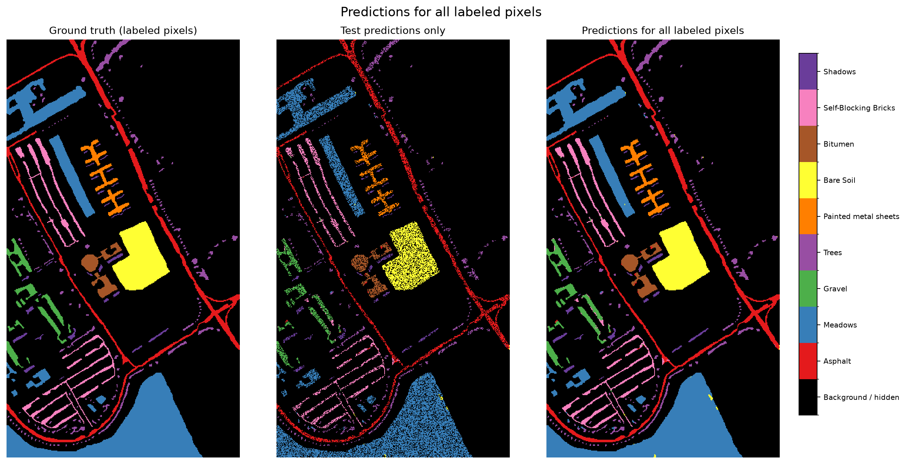
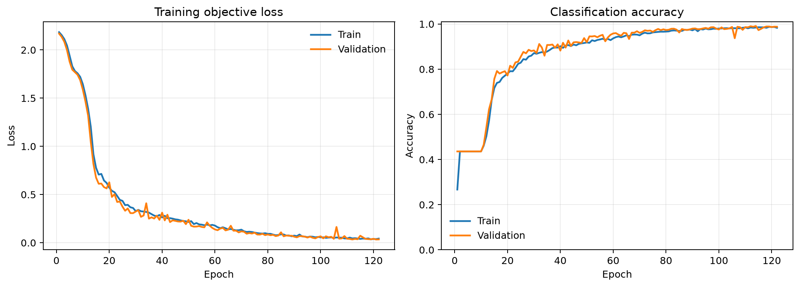
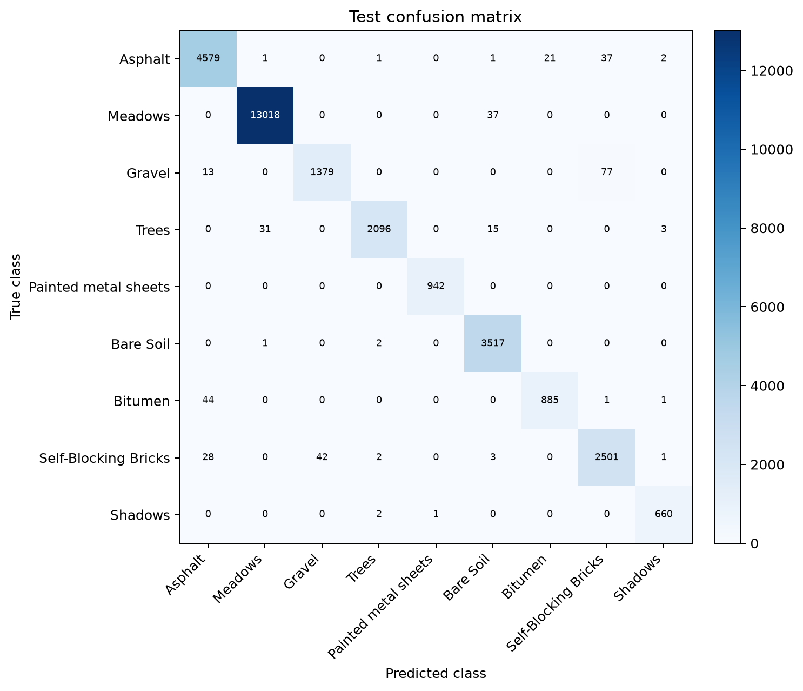
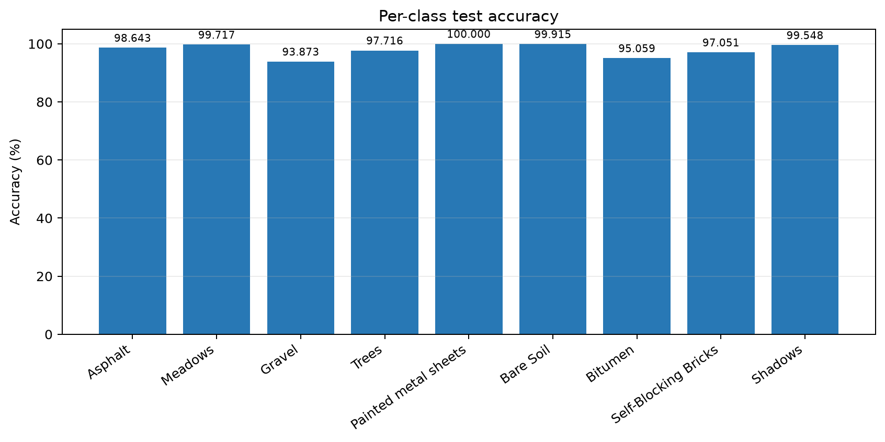

# 本科实验报告

**实验名称：** 大作业5：高光谱智能解译
**课程名称：** 人工智能基础理论与技术（人工智能导论）
**实验时间：** 课后
**任课教师：** 刘欢
**实验地点：** 【请填写】
**助教：** 阮子航

**实验类型：** □ 原理验证　**■ 综合设计**　□ 自主创新

**姓名（组长）：** 【请填写】
**学号（组长）：** 【请填写】
**学院（组长）：** 【请填写】
**组员：** 【请填写】
**组号：** 【请填写】
**成　　绩：** 【请填写】

---

# 一、实验目的

## （一）基本任务

1. **高光谱数据读取与预处理**：掌握高光谱数据及标签的读取、整理和训练测试样本构建方法。本实验以 Pavia University 数据集为主，读取 `.mat` 格式的高光谱影像立方体与地物真值图，完成数据构成分析，建立训练/验证/测试固定划分，并对光谱做逐波段标准化。

2. **高光谱数据降维处理**：学习并使用 PCA、LDA 等方法对高维光谱数据进行降维和特征处理。本实验实现主成分分析（PCA，保留 15 维）与线性判别分析（LDA，监督降维至类别数 −1 = 8 维）两条路线，并保证所有统计量只在训练集上拟合，防止测试集信息泄漏。

3. **HybridSN 高光谱图像分类**：使用 PyTorch 搭建并调通 HybridSN 网络，在给定高光谱数据集上完成模型训练和分类测试，获得最终分类结果。本实验实现了混合 3D–2D 卷积网络 HybridSN，对九类地物进行分类，输出 OA、AA、Kappa、逐类准确率、混淆矩阵与分类图。

## （二）进阶任务

1. **改进 HybridSN 分类模型**：在原始 HybridSN 基础上对网络结构、特征提取方式、训练策略等进行改进。本实验引入 **BatchNorm**、**残差连接**，并将庞大的 `Flatten → 全连接` 分类头替换为**全局平均池化（GAP）轻量分类头**，显著降低模型参数量。

2. **提升高光谱分类精度**：通过模型改进、参数优化或数据处理方法优化，提高模型的分类效果，并与原始 HybridSN 进行比较。本实验在相同数据、划分、随机种子与训练协议下，将改进模型与原始 HybridSN 做**控制变量对比**，报告两者精度与参数效率的权衡，并做误差分析。

## （三）提高任务

1. **复现其他高光谱分类论文**：选取 B. Zhang 等发表于 *Remote Sensing of Environment* 的论文「Three-dimensional convolutional neural network model for tree species classification using airborne hyperspectral images」，理解其 3D-CNN 与 3D-1D-CNN 两个模型的原理并完成 PyTorch 复现与参数量对齐验证。

2. **多模型对比实验**：将复现模型（3D-CNN、3D-1D-CNN）与 HybridSN 在相同实验条件下（同一划分、同一 seed、统一指标）进行比较，分析不同模型的分类性能。

3. **多数据集验证**：在不同高光谱数据集（Pavia University、Indian Pines、Salinas）上进行实验，比较模型在不同场景下的分类效果与泛化性能。

4. **进一步模型创新（选做）**：在复现的 3D-1D-CNN 基础上引入 BatchNorm + 全局平均池化分类头（`ImprovedPaper3D1DCNN`），验证改进方法的有效性。

---

# 二、实验环境

## 1. 数据

本实验采用公开高光谱图像分类数据集，主要包括：

| 数据集 | 空间尺寸 | 波段数 | 地物类别 | 有标签像元 | 场景 |
|---|---:|---:|---:|---:|---|
| Pavia University | 610 × 340 | 103 | 9 | 42,776 | 城市 |
| Indian Pines | 145 × 145 | 220（有效 200） | 16 | 10,249 | 农业 |
| Salinas | 512 × 217 | 204 | 16 | 54,129 | 农业 |

- **Pavia University**：典型城市高光谱遥感数据，由 ROSIS 传感器获取，光谱覆盖约 0.43–0.86 μm，用于开展高光谱图像分类实验（本实验的基本任务与进阶任务均在此数据集上闭环）。
- **Indian Pines**：AVIRIS 传感器获取的农业区影像，原始 220 个光谱波段，去除水汽吸收波段后为 200 个有效波段，16 个地物类别，光谱覆盖约 400–2450 nm。
- **Salinas**：AVIRIS 传感器获取的农业区影像，204 个光谱波段，16 个地物类别。

> **数据集口径说明**：教师模板与 PPT 中提到的第三数据集为 Houston，但由于 Houston 数据未获取，本实验改用同为经典基准、且已在 `data/raw/Salinas_corrected.mat` 中准备好的 **Salinas** 数据集进行多数据集验证。下文所有与第三数据集相关的结果均如实记为 Salinas，不记作 Houston，也不引用任何未实际运行的 Houston 结果。

实验中，基础任务在 Pavia University 上完成；进阶实验在 Pavia University 上完成改进对比；提高任务的多数据集验证计划在 Pavia University、Indian Pines、Salinas 三个数据集上展开。

## 2. 软件及深度学习环境

| 项目 | 本次正式运行 |
|---|---|
| 操作系统 | Windows 11 |
| Python | 3.12.13（项目 `.venv`） |
| PyTorch | 2.12.1+cu130 |
| NumPy | 2.5.2 |
| SciPy | 用于 `.mat` 数据读取与矩阵运算 |
| Scikit-learn | 用于 PCA、LDA 降维及 SVM/KNN/RF 等传统机器学习方法 |
| Matplotlib | 用于训练过程、分类结果及实验结果可视化 |
| GPU | NVIDIA GeForce RTX 5070 Laptop GPU |
| CUDA 构建版本 | 13.0 |
| 训练精度 | float32 |

> 环境备注：系统默认 Anaconda 环境存在 NumPy 2 与旧二进制扩展不兼容的问题，因此本实验只使用项目独立 `.venv`，避免环境混用导致结果不可复现。

## 3. 实验参考程序

- `data_process.py`：学习高光谱数据读取、标签处理及训练测试数据构建流程。
- `HybridSN.ipynb`：学习并复现 HybridSN 高光谱分类网络。
- PCA、LDA 等 sklearn 示例程序：学习降维方法在高光谱数据上的使用。

本实验对应的工程实现（均在 `实验交付/` 下）：

- 原始模型 `src/models/HybridSN模型.py`；改进模型 `src/models/改进HybridSN.py`。
- 数据预处理与划分 `src/datasets/高光谱预处理.py`、`src/datasets/固定划分.py`；光谱预处理拟合 `src/experiments/spectral_preprocessing.py`。
- 训练/推理/checkpoint `src/training/hybridsn_baseline.py`；指标与空间审计 `src/evaluation/classification_metrics.py`。
- 改进对比入口 `scripts/运行HybridSN改进对比.py`；配置 `configs/模型训练/HybridSN_Pavia改进对比.yaml`。
- 论文复现模型 `src/models/Paper3D1DCNN.py`（含 3D-CNN 与 3D-1D-CNN）与 `src/models/改进Paper3D1DCNN.py`；复现脚本 `scripts/运行论文复现.py`。
- 三个自包含 Notebook（`notebooks/`）：`01_数据读取划分与预处理.ipynb`、`02_HybridSN基线训练验证测试.ipynb`、`03_传统分类方法对比.ipynb`。

## 4. 实验评价

主要通过分类准确率评价不同方法的高光谱分类性能，采用三项统一指标：**总体精度（OA）**、**平均精度（AA）** 与 **Cohen's Kappa**，并辅以逐类准确率、混淆矩阵、参数量与训练耗时。对 **原始 HybridSN、改进 HybridSN、复现模型（3D-CNN / 3D-1D-CNN）** 的实验结果进行对比分析。

---

# 三、实验原理

> 本节结合课堂讲授知识和本大作业所涉及的相关知识点，加入自己的理解，不照搬照抄。

## 1. 高光谱分类与谱空联合建模

高光谱像元在数十至数百个连续波段记录地表反射率，同类地物通常具有相似光谱，但不同类别之间可能出现“同物异谱”与“异物同谱”。只使用中心像元的光谱向量会丢失道路形状、建筑边缘和地块纹理等空间结构，因此本实验以中心像元周围的邻域 patch 作为输入，让模型同时观察光谱与空间上下文，实现**光谱—空间联合建模**。HybridSN 使用 25 × 25 邻域，复现的 3D-CNN 系列模型使用 11 × 11 邻域；patch 的中心像元类别作为监督信号。

## 2. 训练集标准化与降维（PCA / LDA）

对训练中心像元第 $b$ 个波段计算均值 $\mu_b$ 与标准差 $\sigma_b$，将光谱标准化为

$$
z_b = \frac{x_b - \mu_b}{\sigma_b}.
$$

**PCA（无监督）**：在训练标准化光谱上求协方差矩阵

$$
\Sigma = \frac{1}{N-1}\sum_{i=1}^{N}(\mathbf{z}_i - \bar{\mathbf{z}})(\mathbf{z}_i - \bar{\mathbf{z}})^{\top},
$$

对其做特征分解 $\Sigma \mathbf{w}_k = \lambda_k \mathbf{w}_k$，取特征值最大的前 $k$ 个主方向构成投影矩阵 $\mathbf{W}_k$，将 103 维光谱映射到 $k$ 维：$\mathbf{Z}_{\text{PCA}} = \mathbf{Z}\mathbf{W}_k$。本实验取 $k=15$。

**LDA（监督）**：利用类别标签最大化类间散度、最小化类内散度。类间散度 $\mathbf{S}_b$ 与类内散度 $\mathbf{S}_w$ 定义为

$$
\mathbf{S}_b = \sum_{c=1}^{C} N_c (\boldsymbol{\mu}_c - \boldsymbol{\mu})(\boldsymbol{\mu}_c - \boldsymbol{\mu})^{\top},
\qquad
\mathbf{S}_w = \sum_{c=1}^{C} \sum_{i \in c}(\mathbf{x}_i - \boldsymbol{\mu}_c)(\mathbf{x}_i - \boldsymbol{\mu}_c)^{\top},
$$

求解广义特征值问题 $\mathbf{S}_b \mathbf{w} = \lambda \mathbf{S}_w \mathbf{w}$，投影维度上限为类别数 $-1$，故 Pavia University 降至 $8$ 维。

**无数据泄漏**：验证/测试数据只使用训练集拟合出的 $\mu_b$、$\sigma_b$ 与投影矩阵执行 `transform`，不重新拟合，从而防止测试统计量进入预处理参数。

**波段选择**：通过 Fisher 得分等准则挑选判别力强的波段子集，是另一种降维思路；本实验将其作为对照路线之一。

## 3. 空间纹理特征（LBP / Gabor，简述）

- **LBP（Local Binary Patterns）**：对每个像元比较其邻域像素与中心像素的灰度关系，编码为二进制模式并统计直方图，刻画局部纹理；公式为 $\mathrm{LBP}_{P,R} = \sum_{p=0}^{P-1} s(g_p - g_c)\,2^{p}$，其中 $s(\cdot)$ 为单位阶跃函数。
- **Gabor 滤波**：用一组不同方向与尺度的 Gabor 核（高斯窗调制的正弦波）对图像卷积，提取多方向、多尺度的纹理响应。本实验中 LBP/Gabor 作为传统空间特征，与光谱特征拼接后送入传统分类器做对照。

## 4. 传统分类器（SVM / XGBoost，简述）

- **SVM（支持向量机）**：在高维空间寻找最大化间隔的分类超平面，目标为 $\min_{\mathbf{w},b}\tfrac{1}{2}\|\mathbf{w}\|^2 + C\sum_i \xi_i$，约束 $y_i(\mathbf{w}^{\top}\phi(\mathbf{x}_i)+b)\ge 1-\xi_i$；通过核函数（RBF）隐式映射到高维空间。
- **XGBoost（极端梯度提升）**：Boosting 家族的一种梯度提升树实现，将多个弱分类器（决策树）加权相加构成强分类器，加性模型 $\hat{y}_i = \sum_t f_t(\mathbf{x}_i)$，正则化目标 $\mathcal{L} = \sum_i l(y_i,\hat{y}_i) + \sum_t \Omega(f_t)$，逐轮拟合上一轮的残差（负梯度）。

## 5. HybridSN 结构（重点详述）

HybridSN（Roy et al., 2020）的动机是：**3D 卷积可联合提取空间—光谱特征，但计算量大；2D 卷积计算更轻，可进一步学习更抽象的空间特征**。因此该网络先用若干层 3D 卷积联合提取谱空特征，再通过重排转成 2D 卷积提取高层空间特征，末端接全连接分类器，从而兼顾光谱信息与计算量。

三维卷积在第 $l$ 层的运算可写为

$$
y_{j}^{l}(x,y,z) = f\Big( \sum_{m} \sum_{p,q,r} w_{j,m}^{l}(p,q,r)\, x_{m}^{l-1}(x+p,\, y+q,\, z+r) + b_j^l \Big),
$$

其中 $(x,y)$ 为空间维，$z$ 为光谱维，$f(\cdot)$ 为激活函数。本实验统一使用 ReLU：

$$
f(x) = \max(0, x).
$$

PyTorch 3D 卷积输入采用 `N×C×D×H×W`，本实验把光谱维放在 $D$ 位置，输入为 `N×1×15×25×25`。逐层尺寸变化与参数量如下表：

| 层 | 核 / 通道 | 输出 shape（batch=N） |
|---|---|---|
| 输入 | — | N×1×15×25×25 |
| Conv3D-1 + ReLU | 1→8，(7,3,3) | N×8×9×23×23 |
| Conv3D-2 + ReLU | 8→16，(5,3,3) | N×16×5×21×21 |
| Conv3D-3 + ReLU | 16→32，(3,3,3) | N×32×3×19×19 |
| 3D→2D reshape | 32×3→96 | N×96×19×19 |
| Conv2D + ReLU | 96→64，3×3 | N×64×17×17 |
| Flatten | 64×17×17 | N×18,496 |
| 全连接分类头 | 18,496→256→128→9 | N×9 logits |

两个隐藏全连接层后使用 Dropout 0.4。模型不使用池化与 BatchNorm，共 **4,844,793** 个可训练参数，其中约 97.7% 集中在 `Flatten(18496) → 256` 这一层。输出为 logits，模型内部不加 Softmax，因为 `CrossEntropyLoss` 已包含 log-softmax 与负对数似然。

Softmax 将 logits 转为概率：

$$
P(y=c \mid \mathbf{x}) = \frac{\exp(z_c)}{\sum_{k=1}^{C}\exp(z_k)},
$$

交叉熵损失为

$$
\mathcal{L} = -\sum_{c=1}^{C} y_c \log P(y=c \mid \mathbf{x}),
$$

其中 $y_c$ 为 one-hot 标签。论文的“特征层级”思想体现在：浅层 3D 卷积捕获低层谱空联合特征（如材料光谱与局部边缘），深层 2D 卷积在重排后的特征图上学习更抽象的语义空间特征，全连接层完成最终判别。


## 6. 改进 HybridSN（BatchNorm + 残差连接 + 全局平均池化）

针对原始 HybridSN 的两处不足做改进：

1. **训练稳定性与梯度流动**：每个卷积层之后、ReLU 之前插入 **BatchNorm**，并将每个 3D/2D 卷积块改为**残差块**——主路径为 `Conv → BN`，短接在通道数变化时用同尺寸卷积投影对齐维度：

$$
\mathbf{y} = \mathrm{ReLU}\big(\mathrm{BN}(\mathrm{Conv}(\mathbf{x})) + \mathrm{shortcut}(\mathbf{x})\big).
$$

BatchNorm 对每个 mini-batch 归一化激活：

$$
\hat{x}^{(k)} = \frac{x^{(k)} - \mu^{(k)}}{\sqrt{(\sigma^{(k)})^2 + \epsilon}},
\qquad
y^{(k)} = \gamma^{(k)}\hat{x}^{(k)} + \beta^{(k)}.
$$

2. **参数效率**：用 **`AdaptiveAvgPool2d((1,1))` 全局平均池化（GAP）** 取代原始 `Flatten(18496) → Linear(256) → Linear(128)` 的庞大分类头，将 64×17×17 特征图平均为 64 维向量后直接 `Linear(64, 9)`。全局平均池化公式为

$$
g_c = \frac{1}{H W}\sum_{h=1}^{H}\sum_{w=1}^{W} f_c(h,w).
$$

改进后结构（3D/2D 卷积的通道、卷积核与原始一致，仅把每个卷积换成带 BN 与投影短接的残差块，并把分类头换成 GAP）：

| 层 | 核 / 通道 | 输出 shape |
|---|---|---|
| Conv3D-1 残差块（BN） | 1→8，(7,3,3) | N×8×9×23×23 |
| Conv3D-2 残差块（BN） | 8→16，(5,3,3) | N×16×5×21×21 |
| Conv3D-3 残差块（BN） | 16→32，(3,3,3) | N×32×3×19×19 |
| 3D→2D reshape | 32×3→96 | N×96×19×19 |
| Conv2D 残差块（BN） | 96→64，3×3 | N×64×17×17 |
| 全局平均池化 | AdaptiveAvgPool2d(1,1) | N×64×1×1 |
| 分类头 | 64→9 | N×9 logits |

改进模型可训练参数为 **152,073**，较原始减少约 **96.9%**（4,844,793 → 152,073）。3D/2D 卷积结构（8/16/32 通道、7/5/3 光谱核、3×3 空间核、valid 填充）与原始完全一致，从而把比较严格限定在“BN + 残差 + GAP”这三处改动上。

## 7. 复现模型 3D-CNN 与 3D-1D-CNN（提高任务，重点）

复现自 **Zhang, B., Zhao, L., Zhang, X. (2020)** 发表于 *Remote Sensing of Environment* 247:111938 的论文。该论文面向机载高光谱树种分类，核心思路与 HybridSN 一致——用 3D 卷积直接从数据立方体中学习联合空间—光谱特征，但结构与 HybridSN 不同：**不使用池化层**，且**不使用 PCA，直接用完整光谱波段输入**。

### 7.1 基础模型 3D-CNN

五层连续三维卷积（1→4→8→16→32→64，卷积核 $7\times3\times3$，valid 卷积，不池化），随后 Dropout(0.5) → Flatten → FC(128) + ReLU → Dropout(0.5) → FC(C)。论文原始实验 $S=11$、$B=125$、$C=12$，输入 `[N,1,125,11,11]`，逐层尺寸如下：

| 层 | 输出尺寸 | 参数量 |
|---|---:|---:|
| Input | 11×11×125×1 | 0 |
| Conv3D-1 | 9×9×119×4 | 256 |
| Conv3D-2 | 7×7×113×8 | 2,024 |
| Conv3D-3 | 5×5×107×16 | 8,080 |
| Conv3D-4 | 3×3×101×32 | 32,288 |
| Conv3D-5 | 1×1×95×64 | 129,088 |
| Dropout | 1×1×95×64 | 0 |
| Flatten | 6080 | 0 |
| Dense | 128 | 778,368 |
| Dense | 12 | 1,548 |

总可训练参数量 **951,652**。valid 卷积的尺寸变化为 $\text{输出} = \text{输入} - \text{核} + 1$。论文**不加池化**的原因是：高光谱树种之间光谱差异可能很细微，若在光谱方向进一步下采样会损失光谱细节，因此保留完整光谱分辨率。

### 7.2 轻量改进模型 3D-1D-CNN

基础 3D-CNN 的 `6080 → 128` 全连接层占约 77.8 万参数（参数最集中处）。论文因此提出 3D-1D-CNN：保留前五层 3D-CNN 主干，将 3D 特征整理为一维序列 `[N, 64, 95]`，用两层 1D 卷积（64→48→24，核 7）继续提取高层特征，最后直接接分类层，取代大规模全连接映射。逐层参数量：

| 层 | 输出尺寸 | 参数量 |
|---|---:|---:|
| 五层 3D-CNN | 1×1×95×64 | 171,736 |
| Reshape | 95×64 | 0 |
| Conv1D-1 | 89×48 | 21,552 |
| Conv1D-2 | 83×24 | 8,088 |
| Flatten | 1992 | 0 |
| Dense | 12 | 23,916 |

总可训练参数量 **225,292**，约为 3D-CNN 的 23.7%。一句话概括：**3D-CNN 联合提取空间—光谱特征；3D-1D-CNN 保留 3D 特征提取能力，并用一维卷积替代参数量较大的全连接特征映射，实现轻量化。**

### 7.3 可行性验证：参数量对齐

在论文原始设定 $B=125, C=12$ 下，运行 `verify_models.py` 得到：

```text
Paper3DCNN   output=(2, 12) params=951,652
Paper3D1DCNN output=(2, 12) params=225,292
Verification passed: shapes and paper parameter counts match.
```

说明模型输出类别维度正确、3D-CNN 与 3D-1D-CNN 参数量分别与论文表 4、表 5 一致，复现可信。

> **与 HybridSN 的关键区别**：本论文模型分支**不做 PCA**，使用原始有效波段输入，patch 为 11×11；HybridSN 使用 PCA15 + 25×25 patch。因此多模型对比时，两者采用各自的论文预处理，但共享同一套 train/validation/test 中心像元划分与统一指标，保证对比公平。

### 7.4 改进 3D-1D-CNN（选做创新）

在复现的 3D-1D-CNN 基础上做 **BatchNorm + 全局平均池化分类头** 两处改动（`ImprovedPaper3D1DCNN`）：每个 3D/1D 卷积后、ReLU 前插入 BatchNorm；用 `AdaptiveAvgPool1d(1)` 取代 `Flatten(24·L) → Linear(C)` 的末尾全连接，把 24 通道序列在长度维平均为 24 维向量后直接 `Linear(24, C)`。3D 主干与两层 1D 卷积的通道、核与原始一致。此处**不引入残差短接**，因为残差块在通道变化时需投影卷积对齐维度，会为本就轻量的 3D-1D-CNN 额外增加卷积参数，抵消 GAP 的收益；故轻量改进以「BN（近零参数成本）+ GAP（移除末尾全连接）」为主，确保改进方向真正指向更小参数量。

## 8. 评价指标

- **OA（Overall Accuracy，总体精度）**：全部测试样本中预测正确的比例，$\mathrm{OA} = \frac{1}{N}\sum_{i}\mathbb{1}[\hat{y}_i = y_i]$。
- **每类准确率**：混淆矩阵第 $i$ 类对角元素除以该类测试样本数。
- **AA（Average Accuracy，平均精度）**：各类别准确率的算术平均，降低大类样本对 OA 的支配，$\mathrm{AA} = \frac{1}{C}\sum_{c=1}^{C}\mathrm{acc}_c$。
- **Cohen's Kappa**：对随机一致性校正，$\kappa = \dfrac{p_o - p_e}{1 - p_e}$，其中 $p_o$ 为观察一致率，$p_e$ 由混淆矩阵行列边际概率计算。

---

# 四、实验内容和结果分析

> 本节详尽写出实验过程、实验结果与误差分析，图文并茂；表格、代码、结果与参考文献作为附件提交。所有数值均来自正式运行产出的 `metrics.json` / `summary_row.json` / `performance.json`，未做任何虚构。

## 1. 数据读取与划分

读取 `.mat` 得到影像立方体（610×340×103）与地物真值图，提取 42,776 个有标签像元。图 1 为 Pavia University 假彩色合成图（取三个代表性波段作 RGB）与地物真值图；图 2 为各类别样本数量分布，可见明显的**类别不平衡**（Meadows 最多、Shadows 最少），这是采用分层随机划分与平均精度 AA 的原因。




采用两层**分层随机划分**：先按 30% / 70% 划分训练池 / 测试集，再从训练池按 80% / 20% 划分训练集 / 验证集，最终得到训练 / 验证 / 测试 = 24% / 6% / 70%（10,265 / 2,567 / 29,944），协议名 `fair24_6_70`，seed = 1442。划分空间分布如图 3 所示。此外保留了 `paper30`（30% 训练 / 70% 测试）作为论文兼容基线。


三个数据集在 `fair24_6_70 + seed1442` 协议下的样本数如下：

| 数据集 | 有标签像元 | 训练集 | 验证集 | 测试集 |
|---|---:|---:|---:|---:|
| Pavia University | 42,776 | 10,265 | 2,567 | 29,944 |
| Indian Pines | 10,249 | 2,459 | 615 | 7,175 |
| Salinas | 54,129 | 12,990 | 3,248 | 37,891 |

## 2. 预处理与降维

预处理流程为“**逐波段标准化 → 降维**”，所有统计量只在训练集拟合后变换整幅图像。降维方案包括 `raw`（仅标准化）、`pca15`（PCA 保留 15 维）、`lda8`（监督 LDA 降至 8 维）以及波段选择（等间隔均匀 / Fisher 得分）。图 4 给出 PCA 累计解释方差、PCA 前两主成分散点（按类别着色）与 Fisher 波段选择得分；后续 HybridSN 模型统一采用 **PCA15** 路线（103 → 15 维），复现的 3D-CNN 系列模型则按论文要求**不做 PCA**、使用原始 103 波段。



## 3. HybridSN 基线训练与结果

训练超参数如下（改进对比实验与基线使用完全相同的协议，从而隔离模型结构这一单一变量）：

| 参数 | 数值 |
|---|---:|
| 随机种子 | 1442 |
| 优化器 | Adam |
| 学习率 | 0.001 |
| weight decay | 0.0 |
| batch size | 256 |
| epochs | 30 |
| checkpoint 选择 | 验证集最优 OA |


原始 HybridSN 在验证集上快速收敛（约第 5 轮即达到约 99.96% 的最优 OA），训练/验证损失与准确率曲线如图 5 所示。在测试集上取得：

| 指标 | 结果 |
|---|---:|
| 测试样本数 | 29,944 |
| OA | **99.9532%** |
| AA | **99.9405%** |
| Cohen's Kappa | **0.999381** |
| 误分样本数 | 14 |
| 可训练参数量 | 4,844,793 |


逐类结果（图 6、图 7 为混淆矩阵与逐类准确率）：

| 类别 | 测试样本 | 正确数 | 准确率 |
|---|---:|---:|---:|
| Asphalt | 4,642 | 4,642 | 100.0000% |
| Meadows | 13,055 | 13,049 | 99.9540% |
| Gravel | 1,469 | 1,469 | 100.0000% |
| Trees | 2,145 | 2,145 | 100.0000% |
| Painted metal sheets | 942 | 941 | 99.8938% |
| Bare Soil | 3,520 | 3,520 | 100.0000% |
| Bitumen | 931 | 931 | 100.0000% |
| Self-Blocking Bricks | 2,577 | 2,571 | 99.7672% |
| Shadows | 663 | 662 | 99.8492% |


基线共误分 14 个测试像元：6 个 Meadows 判为 Trees、3 个 Bricks 判为 Gravel、3 个 Bricks 判为 Trees、1 个 Painted 判为 Shadows、1 个 Shadows 判为 Bitumen。这些误分集中在“植被类（Meadows/Trees）”与“暗色地物（Bitumen/Shadows）”之间，符合光谱—空间局部上下文易混淆的直觉。

## 4. 改进 HybridSN 与对比实验（进阶任务）

### 4.1 改进动机

原始 HybridSN 高达 4,844,793 个参数，其中约 97.7% 集中在 `Flatten(18496) → 256` 这一层。这带来两个问题：(1) 模型体积大、易在小样本或更难数据集（如 Indian Pines）上过拟合；(2) 全连接头对空间位置敏感、参数冗余。因此本实验引入 **BatchNorm + 残差连接** 以稳定训练并改善梯度流动，同时用 **全局平均池化** 替换全连接头，把参数量压缩两个数量级。

### 4.2 控制变量实验设置

为保证公平，改进对比实验与基线使用**完全相同**的数据身份、预处理指纹（`standard_pca15`）、划分、随机种子 1442 与训练协议（Adam / lr=0.001 / batch=256 / 30 epoch / 验证集选最优 checkpoint），唯一变量是模型结构。

### 4.3 整体指标与参数量对比

| 指标 | 原始 HybridSN | 改进 HybridSN |
|---|---:|---:|
| 可训练参数量 | 4,844,793 | **152,073**（−96.9%） |
| OA | **99.9532%** | 99.7328% |
| AA | **99.9405%** | 99.3404% |
| Cohen's Kappa | **0.999381** | 0.996459 |
| 误分样本数 | **14** | 80 |


结果如左图所示：改进模型以**约 97% 的参数削减**换取了 OA 0.22 个百分点的下降（99.9532% → 99.7328%），AA 下降 0.60 个百分点（99.9405% → 99.3404%）。整体精度仍保持在 99.7% 以上的高位。

### 4.4 逐类精度与误差分析

逐类准确率对比如下：

| 类别 | 原始 HybridSN | 改进 HybridSN |
|---|---:|---:|
| Asphalt | 100.0000% | 100.0000% |
| Meadows | 99.9540% | 99.9617% |
| Gravel | 100.0000% | 99.5916% |
| Trees | 100.0000% | 98.4615% |
| Painted metal sheets | 99.8938% | 99.6815% |
| Bare Soil | 100.0000% | 100.0000% |
| Bitumen | 100.0000% | 100.0000% |
| Self-Blocking Bricks | 99.7672% | 99.5343% |
| Shadows | 99.8492% | 96.8326% |

改进模型新增的误差几乎全部集中在少数类 **Trees**（33 个误分，其中 19 个判为 Bricks、11 个判为 Meadows）与 **Shadows**（21 个误分，其中 9 个判为 Painted、6 个判为 Trees）。这正是 AA 下降幅度（0.60pp）大于 OA（0.22pp）的原因：AA 对少数类更敏感，而 Trees / Shadows 这两类的精度下降最明显。

这一现象的合理解释是：全局平均池化把 17×17 特征图压成单一 64 维向量，丢失了细粒度空间纹理细节；而原始 HybridSN 的 `Flatten(18496) → 256` 头虽然参数冗余，却能保留完整空间布局，在“Trees 与 Bricks/Shadows 边界”这类依赖细粒度纹理判别的像元上更有优势。

### 4.5 参数效率与计算代价分析

| 性能项 | 原始 HybridSN | 改进 HybridSN |
|---|---:|---:|
| 参数量内存（float32） | 18.48 MiB | 0.58 MiB |
| 训练总时间 | 125.79 s | 247.90 s |
| 平均每 epoch | 3.99 s | 7.56 s |
| 测试推理吞吐 | 12,208 samples/s | 3,370 samples/s |

值得注意：虽然改进模型参数量减少了 96.9%，其训练与推理时间反而**约翻倍**。原因是残差短接的投影卷积与 BatchNorm 增加了实际卷积计算量，而原始 HybridSN 的参数冗余集中在 `Flatten → 256` 这一层——它是一个成本较低的矩阵乘法；真正决定计算量的是 3D 卷积。因此本改进的价值在于**模型体积与内存占用**（利于部署、缓解过拟合），而非推理速度。

**小结**：在 Pavia University 的随机像元划分上，原始 HybridSN 已达到 99.95% 的近似天花板，改进模型难以在精度上超越，反而在少数类上略有回落。但改进模型以 0.22pp OA 的代价实现了约 97% 的参数削减，且 BatchNorm + 残差连接为训练提供了更好的稳定性与梯度流动。可以预期，在类别更多、样本更少、更易过拟合的数据集（如 Indian Pines）上，轻量化改进的相对优势会更明显——这留作多数据集扩展。

## 5. 传统分类方法对比（扩展）

为横向验证 HybridSN 的优势，使用相同的 PCA15 中心像元光谱特征（15 维）与相同划分，测试 SVM / KNN / LDA / 随机森林 / XGBoost：

| 方法 | OA | AA | Kappa |
|---|---:|---:|---:|
| SVM（RBF） | 93.50% | 91.25% | 91.34% |
| XGBoost | 93.04% | 90.23% | 90.72% |
| 随机森林 | 91.74% | 87.84% | 88.91% |
| KNN | 87.80% | 85.18% | 83.54% |
| LDA | 83.62% | 77.21% | 78.06% |





传统方法中最优的 SVM 仅达 93.50% OA，HybridSN（99.95%）领先约 6.4 个百分点。差距主要源于两点：HybridSN 以 25×25 邻域 patch 为输入、显式建模光谱—空间联合特征，而传统方法仅用中心像元光谱向量，丢失空间邻域结构；深度网络的多层非线性变换也能学到更复杂的判别特征。

## 6. 论文复现：3D-CNN 与 3D-1D-CNN（提高任务）

### 6.1 复现流程与设置

按论文要求，复现模型使用**原始 103 波段（不 PCA）**、11×11 patch，输入 `N×1×103×11×11`。训练协议沿用论文设定：SGD、学习率 1e-4、batch size 64、Dropout 0.5、最大 300 epoch，并启用 Early Stopping（验证 loss 连续 10 轮改善不足 0.003 时停止）。数据划分为 `fair24_6_70 + seed1442`，与 HybridSN 完全一致，仅预处理（不 PCA、patch=11）与训练协议按各论文要求。因本实验数据集的波段数/类别数与论文原始设定（B=125、C=12）不同，模型在 Pavia 上的实际参数量为：

| 模型 | 论文原始（B=125, C=12） | Pavia 实际（B=103, C=9） |
|---|---:|---:|
| Paper3DCNN | 951,652 | **771,041** |
| Paper3D1DCNN | 225,292 | **214,561** |

### 6.2 Paper3DCNN 结果

| 指标 | 结果 |
|---|---:|
| 可训练参数量 | 771,041 |
| 训练轮数 | 155（Early Stopping） |
| 训练总耗时 | 1454.27 s（平均 9.13 s/epoch） |
| OA | **99.0048%** |
| AA | **98.3692%** |
| Cohen's Kappa | **0.986806** |
| 测试损失 | 0.031136 |








逐类准确率：

| 类别 | 测试样本 | 准确率 |
|---|---:|---:|
| Asphalt | 4,642 | 99.20% |
| Meadows | 13,055 | 99.69% |
| Gravel | 1,469 | 93.94% |
| Trees | 2,145 | 97.48% |
| Painted metal sheets | 942 | 100.00% |
| Bare Soil | 3,520 | 99.91% |
| Bitumen | 931 | 96.99% |
| Self-Blocking Bricks | 2,577 | 98.25% |
| Shadows | 663 | 99.85% |

### 6.3 Paper3D1DCNN 结果

| 指标 | 结果 |
|---|---:|
| 可训练参数量 | 214,561 |
| 训练轮数 | 122（Early Stopping） |
| 训练总耗时 | 1144.23 s（平均 9.13 s/epoch） |
| OA | **98.7744%** |
| AA | **97.9467%** |
| Cohen's Kappa | **0.983756** |
| 测试损失 | 0.037761 |








逐类准确率：

| 类别 | 测试样本 | 准确率 |
|---|---:|---:|
| Asphalt | 4,642 | 98.64% |
| Meadows | 13,055 | 99.72% |
| Gravel | 1,469 | 93.87% |
| Trees | 2,145 | 97.72% |
| Painted metal sheets | 942 | 100.00% |
| Bare Soil | 3,520 | 99.91% |
| Bitumen | 931 | 95.06% |
| Self-Blocking Bricks | 2,577 | 97.05% |
| Shadows | 663 | 99.55% |

两个复现模型在 Pavia 上均达到 98.7% 以上的 OA，且 **3D-CNN 略高于 3D-1D-CNN**（99.00% vs 98.77%），符合“轻量化以少量精度换取参数效率”的论文结论。

## 7. 多模型对比（原始 / 改进 HybridSN 与复现模型）

下表在**同一划分 `fair24_6_70`、同一 seed=1442、统一指标**下汇总四类模型（复现模型的原始光谱输入与 11×11 patch、HybridSN 的 PCA15 与 25×25 patch 均按各自论文要求），测试集仅评测一次：

| 模型 | 波段/patch | 参数量 | OA | AA | Kappa | 训练耗时 |
|---|---:|---:|---:|---:|---:|---:|
| 原始 HybridSN | PCA15 / 25×25 | 4,844,793 | **99.9532%** | **99.9405%** | **0.999381** | 125.79 s |
| 改进 HybridSN | PCA15 / 25×25 | **152,073** | 99.7328% | 99.3404% | 0.996459 | 247.90 s |
| Paper3DCNN | 103 / 11×11 | 771,041 | 99.0048% | 98.3692% | 0.986806 | 1454.27 s |
| Paper3D1DCNN | 103 / 11×11 | 214,561 | 98.7744% | 97.9467% | 0.983756 | 1144.23 s |

**对比分析**：

1. **精度排序**：原始 HybridSN > 改进 HybridSN > 3D-CNN > 3D-1D-CNN。HybridSN 以 PCA15 + 更大的 25×25 patch 取得最高精度；复现模型在原始 103 波段、较小 11×11 patch 下仍达 98.7%–99.0%，验证了 3D 卷积提取谱空联合特征的有效性。
2. **参数效率**：改进 HybridSN（152K）与 3D-1D-CNN（214K）都通过去掉参数量集中的全连接头实现约 95% 级别的削减；两者证明了“全连接分类头是参数冗余主因”这一共性结论。
3. **训练代价**：复现模型使用论文的 SGD + lr=1e-4 + 300 epoch 协议，且不做 PCA（输入 103 波段），训练耗时（>1100 s）远高于 HybridSN（≈126 s）。这提示 PCA 降维不仅能提升紧凑性，也能显著降低 3D 卷积的计算量。

## 8. 多数据集验证（Pavia / Indian Pines / Salinas）

为验证泛化性，计划将原始/改进 HybridSN 与复现模型在三个数据集上对比。目前 Pavia University 已闭环；Indian Pines（145×145，200 有效波段，16 类，10,249 有标签像元，train/val/test = 2459/615/7175）与 Salinas（512×217，204 波段，16 类，54,129 有标签像元，train/val/test = 12990/3248/37891）的固定划分与预处理状态已就绪，**模型训练与评测结果待实验数据填入**。

| 数据集 | 原始 HybridSN | 改进 HybridSN | Paper3DCNN | Paper3D1DCNN |
|---|---|---|---|---|
| Pavia University | 99.9532% | 99.7328% | 99.0048% | 98.7744% |
| Indian Pines | 待实验数据填入 | 待实验数据填入 | 待实验数据填入 | 待实验数据填入 |
| Salinas | 待实验数据填入 | 待实验数据填入 | 待实验数据填入 | 待实验数据填入 |

> 预期分析（供后续填入）：Indian Pines 类别多、样本少且类内光谱易混，更易过拟合，轻量化改进（改进 HybridSN、3D-1D-CNN）的相对优势有望比在 Pavia 上更明显；Salinas 样本量大、类别呈规则地块分布，各模型精度预计普遍较高。

## 9. 进一步模型创新（选做，进行中）

在复现 3D-1D-CNN 基础上加入 **BatchNorm + 全局平均池化分类头**（`ImprovedPaper3D1DCNN`），结构见 3.7.4 节。该模型已完成结构定义并已启动训练（截至撰写时训练进行中，约第 89/300 轮，验证准确率约 96%），**最终指标待实验数据填入**。其参数量理论值约为 **202,000**（较原始 3D-1D-CNN 的 214,561 减少约 6%），因为 3D-1D-CNN 本已轻量、末尾全连接较小，GAP 的收益有限，BN 是主要新增项——这一观察本身也说明了“全连接头占比越大，GAP 收益越显著”的规律。

## 10. 误差分析总结

综合各模型在 Pavia University 上的混淆矩阵，误分主要集中在以下类间：

- **Gravel ↔ Self-Blocking Bricks**：两类均为小尺寸人工硬质表面，光谱接近，复现模型中 Gravel 误分为 Bricks 的数量最多（Paper3DCNN 为 77、Paper3D1DCNN 为 77）。
- **Asphalt ↔ Bitumen / Bricks**：同为暗色/铺装材料，Paper3D1DCNN 中 Bitumen 误分为 Asphalt 44 个、Asphalt 误分为 Bricks 37 个。
- **Trees ↔ Meadows / Bare Soil**：植被类间光谱相似，且受 11×11 较小 patch 的上下文限制，边界像元易混。
- **改进 HybridSN 的 Trees / Shadows 回落**：源于 GAP 头丢失细粒度空间纹理。

改进方向：(1) 增大 patch 或引入注意力机制增强边界判别；(2) 对少数类做类别加权损失或数据增强；(3) 在易混类上引入更细的谱段选择；(4) 用空间块划分（而非随机像元）评估真实跨区域泛化能力。

## 11. 结果文件完整性

各实验运行目录包含：`config.yaml`、`environment.json`、`history.json/csv`、`checkpoint_*.pt`、`metrics.json`（OA/AA/Kappa/逐类/混淆矩阵）、`performance.json`（时间/吞吐/显存）、`summary_row.json`、`predictions_test.npz`、`classification_maps.npz`、`spatial_overlap_audit.json` 以及本报告引用的各结果图（学习曲线、混淆矩阵、逐类精度、分类图）。

---

# 五、参考文献

[1] S. K. Roy, G. Krishna, S. R. Dubey, and B. B. Chaudhuri, "HybridSN: Exploring 3-D–2-D CNN Feature Hierarchy for Hyperspectral Image Classification," *IEEE Geoscience and Remote Sensing Letters*, vol. 17, no. 2, pp. 277–281, 2020, doi: 10.1109/LGRS.2019.2918719.

[2] B. Zhang, L. Zhao, and X. Zhang, "Three-dimensional convolutional neural network model for tree species classification using airborne hyperspectral images," *Remote Sensing of Environment*, vol. 247, 111938, 2020.

[3] K. He, X. Zhang, S. Ren, and J. Sun, "Deep Residual Learning for Image Recognition," *CVPR*, 2016（残差连接思想来源）。

[4] S. Ioffe and C. Szegedy, "Batch Normalization: Accelerating Deep Network Training by Reducing Internal Covariate Shift," *ICML*, 2015。

[5] M. Lin, Q. Chen, and S. Yan, "Network In Network," *arXiv:1312.4400*, 2013（全局平均池化思想来源）。

[6] Pavia University、Indian Pines、Salinas 数据集出处：University of Pavia（ROSIS）、NASA AVIRIS（Indian Pines 由 Purdue University 整理，Salinas 由 NASA JPL），经 UPV/EHU Computational Intelligence Group 分发。

[7] Scikit-learn developers, *PCA / LinearDiscriminantAnalysis / SVM / RandomForest / XGBoost documentation*。

[8] PyTorch contributors, *Conv3d / Conv2d / Conv1d / BatchNorm / AdaptiveAvgPool2d / CrossEntropyLoss / Adam / SGD documentation*。

[9] 教师课程资料：《大作业5：高光谱大作业》与《大作业安排20260814》；实验报告模板《实验报告-大作业-组号(1)》。

---

# 六、心得体会

（本节由各组员结合本人实际工作独立完成，内容不限；以下为建议作答要点，可自行增删）

1. **可复现性比“能跑通”更难**：从“能前向传播”到“可复现正式实验”，最容易忽略的是固定随机种子、冻结预处理统计量、记录预处理指纹与 checkpoint 选择标准。一个 99.95% 的 OA 若来自不同划分或不同 seed，就无法与别人对齐比较。

2. **高分不等于泛化好**：随机像元划分下测试 patch 与训练中心像元高度重叠，99.95% 的 OA 不能直接解读为跨区域泛化能力，仍需检查空间重叠与划分协议。

3. **工程踩坑**：3D→2D 特征重排（`32×3→96`）、残差块在通道变化时的投影短接维度对齐、logits 与 `CrossEntropyLoss` 的接口约定，是本实验中最容易出错的几处。

4. **参数效率 vs 精度**：改进 HybridSN“参数量降 97% 但精度略降”，以及 3D-1D-CNN 相较 3D-CNN 的轻量化，都让我理解到全连接分类头往往是参数冗余主因，而真正决定计算量的是 3D 卷积——轻量化的价值在于部署与抗过拟合，而非一味追求更少参数。

5. **对课程的反馈**：（请结合个人实际填写，例如对数据准备、复现流程、评分标准的感受与建议。）

---

# 附件与 Word 排版清单

最终 Word 报告继续使用教师原始模板，不改变封面、主标题顺序与评分说明。建议插入以下证据：

1. 项目环境检查与全仓 `pytest` 通过截图；
2. 模型结构、逐层 shape 与参数量输出截图（原始 4,844,793 / 改进 152,073 / Paper3DCNN 771,041 / Paper3D1DCNN 214,561）；
3. 正式训练日志的首几轮与最优轮截图；
4. 本文全部结果图（图 1–图 20），并在图下注明 run 名称与 seed；
5. 指标与性能表（不只贴图片）；
6. 改进对比表与误差分析表；
7. 论文复现的参数量对齐验证截图（`verify_models.py` 输出）；
8. 代码附件、配置、run manifest、checkpoint、预测 NPZ 与参考文献；
9. 组内分工与权重（总和 100%），由组长按实际工作量填写。
