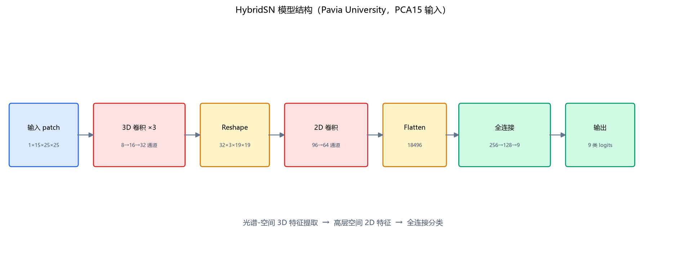
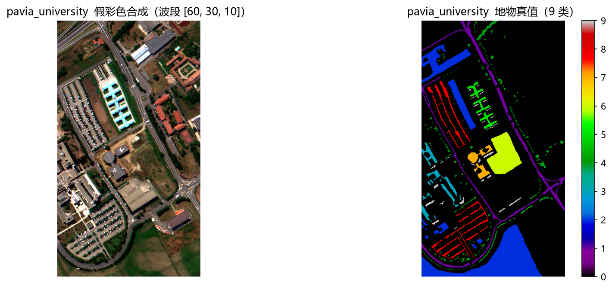
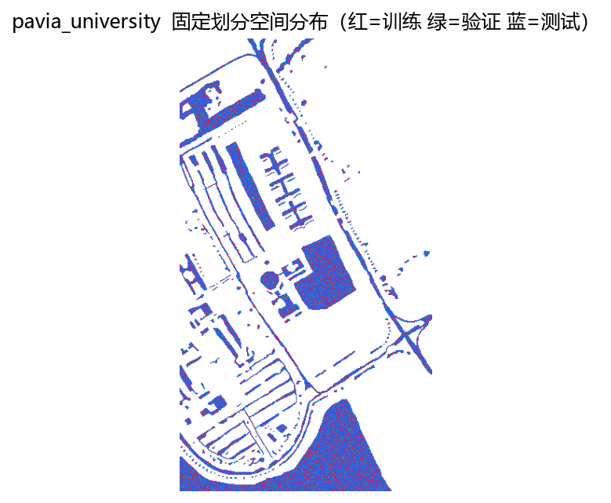
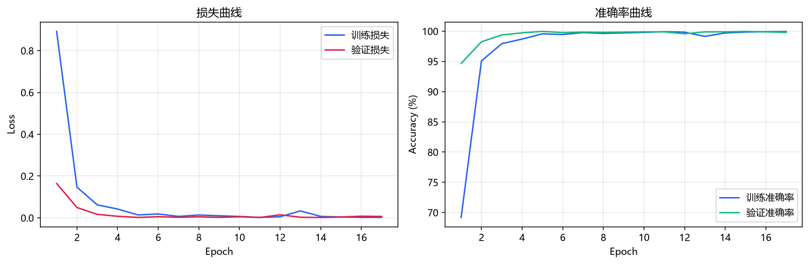
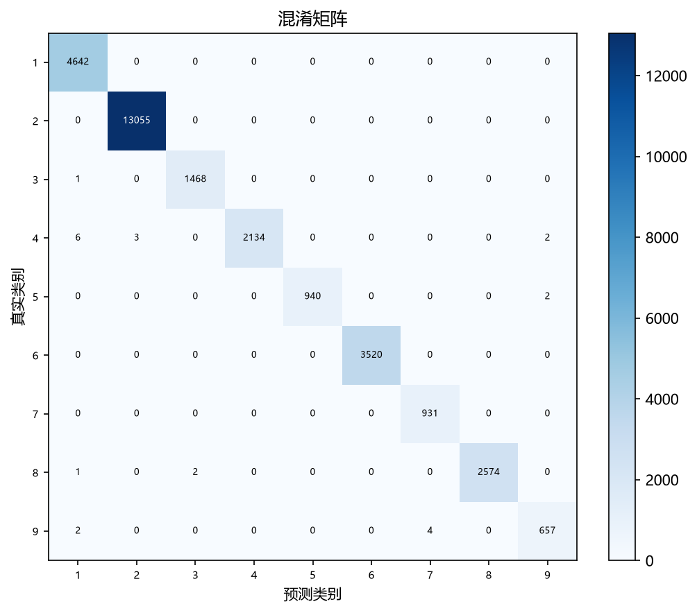
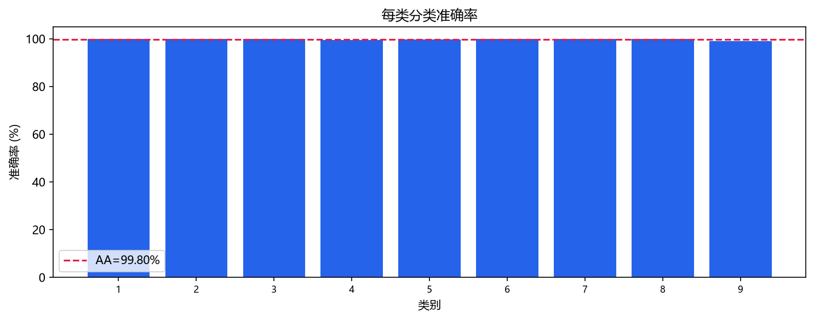
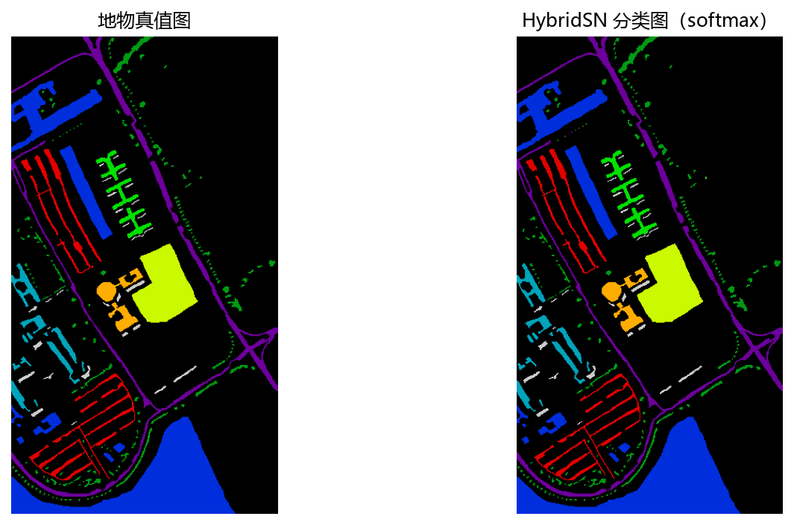
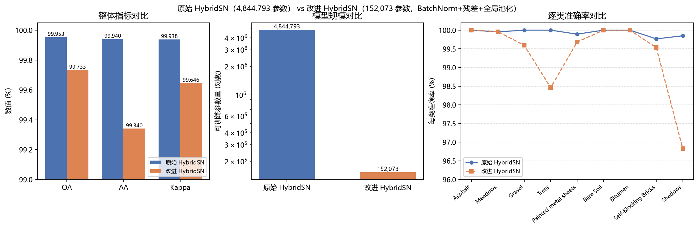
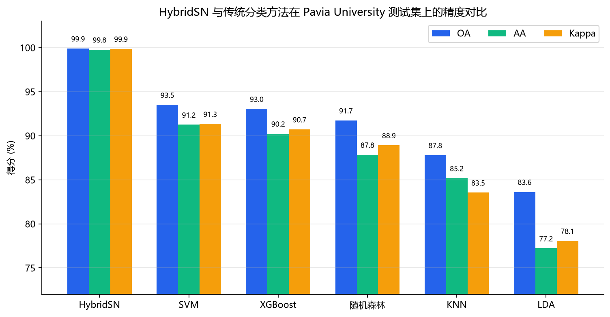

# 本科实验报告

# 一、实验目的

## （一）基本任务

1. **高光谱数据读取与预处理**：读取 Pavia University 等 `.mat` 格式的高光谱影像立方体与地物真值图，完成数据构成分析，建立训练 / 验证 / 测试固定划分，并对光谱做逐波段标准化。
2. **降维处理（PCA / LDA）**：实现主成分分析（PCA，保留 15 维）与线性判别分析（LDA，监督降维至类别数 −1 = 8 维）两种降维路线，并保证所有统计量只在训练集上拟合，防止测试集信息泄漏。
3. **HybridSN 分类**：使用 PyTorch 实现并训练混合 3D–2D 卷积网络 HybridSN，对九类地物进行分类，输出 OA、AA、Kappa、逐类准确率、混淆矩阵与分类图。

## （二）进阶任务

1. **改进 HybridSN 模型**：在原始 HybridSN 基础上引入 **BatchNorm**、**残差连接**，并将庞大的 `Flatten → 全连接` 分类头替换为**全局平均池化（GAP）轻量分类头**，显著降低模型参数量。
2. **提升高光谱分类精度**：在相同数据、划分、随机种子与训练协议下，将改进模型与原始 HybridSN 做**控制变量对比**，报告两者精度与参数效率的权衡，并做误差分析。

# 二、实验环境

## 1. 数据

- 数据集：**Pavia University**。
- 原始影像：610 × 340 像元，103 个光谱波段；有标签像元 42,776 个，包含 9 类地物（Asphalt、Meadows、Gravel、Trees、Painted metal sheets、Bare Soil、Bitumen、Self-Blocking Bricks、Shadows）。
- 固定划分：`fair24_6_70`，split seed = 1442；训练集 10,265、验证集 2,567、测试集 29,944（24% / 6% / 70%）。
- 光谱处理：逐波段标准化后 PCA 降至 15 维（`whiten=false`）；标准化与 PCA 均只在训练集中心像元上拟合。
- 空间表示：25 × 25 邻域 patch，边界零填充，以中心像元标签作为监督信号。

## 2. 软件及深度学习环境

| 项目 | 本次正式运行 |
|---|---|
| 操作系统 | Windows 11 |
| Python | 3.12.13（项目 `.venv`） |
| PyTorch | 2.12.1+cu130 |
| NumPy | 2.5.2 |
| GPU | NVIDIA GeForce RTX 5070 Laptop GPU |
| CUDA 构建版本 | 13.0 |
| 训练精度 | float32 |

系统默认 Anaconda 环境存在 NumPy 2 与旧二进制扩展不兼容的问题，因此本实验只使用项目 `.venv`，避免环境混用导致结果不可复现。

## 3. 实验程序与附件

- 原始模型：`src/models/HybridSN模型.py`；改进模型：`src/models/改进HybridSN.py`。
- 数据预处理与划分：`src/datasets/高光谱预处理.py`；光谱预处理拟合：`src/experiments/spectral_preprocessing.py`。
- 训练 / 推理 / checkpoint：`src/training/hybridsn_baseline.py`；指标与空间审计：`src/evaluation/classification_metrics.py`。
- 改进对比入口：`scripts/运行HybridSN改进对比.py`；配置：`configs/模型训练/HybridSN_Pavia改进对比.yaml`。
- 三个自包含 Notebook（`实验交付/notebooks/`）：`01_数据读取划分与预处理.ipynb`、`02_HybridSN基线训练验证测试.ipynb`、`03_传统分类方法对比.ipynb`。
- 正式运行目录：`hsi_project/experiments/hybridsn_improvement_comparison__fair24_6_70__seed1442__*/`。

# 三、实验原理

## 1. 高光谱分类与谱空联合建模

高光谱像元在数十至数百个连续波段记录地表反射率，同类地物通常具有相似光谱，但不同类别之间可能出现“同物异谱”与“异物同谱”。只使用中心像元光谱会忽略道路形状、建筑边缘和地块纹理等空间结构。因此本实验以中心像元周围的 25 × 25 邻域作为输入，让模型同时观察光谱与空间上下文，实现光谱—空间联合建模。

## 2. 训练集标准化与降维（PCA / LDA）

对训练中心像元第 (b) 个波段计算均值 \(\mu_b\) 与标准差 \(\sigma_b\)，将光谱标准化为

\[
z_b=\frac{x_b-\mu_b}{\sigma_b}.
\]

**PCA（无监督）**：在训练标准化光谱上求解主方向，将 103 维光谱映射到 15 维。**LDA（监督）**：利用类别标签最大化类间散度、最小化类内散度，投影维度上限为类别数 −1，故 Pavia University 降至 8 维。验证 / 测试数据只使用训练集拟合出的 \(\mu_b\)、\(\sigma_b\) 与投影矩阵执行变换，不重新拟合，从而防止测试统计量进入预处理参数。

## 3. HybridSN 结构

HybridSN 将 3D 卷积（联合提取光谱—空间特征）与 2D 卷积（高层空间特征）级联，末端接全连接分类器。PyTorch 3D 卷积输入采用 `N×C×D×H×W`，本实验输入为 `N×1×15×25×25`：

| 层 | 核/通道 | 输出 shape（batch=N） |
|---|---|---|
| Conv3D-1 + ReLU | 1→8，(7,3,3) | N×8×9×23×23 |
| Conv3D-2 + ReLU | 8→16，(5,3,3) | N×16×5×21×21 |
| Conv3D-3 + ReLU | 16→32，(3,3,3) | N×32×3×19×19 |
| 3D→2D reshape | 32×3→96 | N×96×19×19 |
| Conv2D + ReLU | 96→64，3×3 | N×64×17×17 |
| Flatten | 64×17×17 | N×18,496 |
| 全连接分类头 | 18,496→256→128→9 | N×9 logits |

两个隐藏全连接层后使用 Dropout 0.4。模型不使用池化与 BatchNorm，共 **4,844,793** 个可训练参数，其中约 4,734,976 个（97.7%）集中在 `Flatten → 256` 这一层。输出为 logits，模型内部不加 Softmax，因为 `CrossEntropyLoss` 已包含 log-softmax 与负对数似然。

## 4. 改进 HybridSN（BatchNorm + 残差连接 + 全局平均池化）

针对原始 HybridSN 的两处不足做改进：

1. **训练稳定性与梯度流动**：每个卷积层之后、ReLU 之前插入 **BatchNorm**，并将每个 3D/2D 卷积块改为**残差块**——主路径为 `Conv → BN`，短接在通道数变化时用同尺寸卷积投影对齐维度，即

\[
\mathbf{y}=\mathrm{ReLU}\big(\mathrm{BN}(\mathrm{Conv}(\mathbf{x}))+\mathrm{shortcut}(\mathbf{x})\big).
\]

2. **参数效率**：用 **`AdaptiveAvgPool2d((1,1))` 全局平均池化**取代原始 `Flatten(18496) → Linear(256) → Linear(128)` 的庞大分类头，将 64×17×17 特征图平均为 64 维向量后直接 `Linear(64, 9)`。

改进后结构（3D/2D 卷积的通道、卷积核与原始一致，仅把每个卷积换成带 BN 与投影短接的残差块，并把分类头换成 GAP）：

| 层 | 核/通道 | 输出 shape |
|---|---|---|
| Conv3D-1 残差块（BN） | 1→8，(7,3,3) | N×8×9×23×23 |
| Conv3D-2 残差块（BN） | 8→16，(5,3,3) | N×16×5×21×21 |
| Conv3D-3 残差块（BN） | 16→32，(3,3,3) | N×32×3×19×19 |
| 3D→2D reshape | 32×3→96 | N×96×19×19 |
| Conv2D 残差块（BN） | 96→64，3×3 | N×64×17×17 |
| 全局平均池化 | AdaptiveAvgPool2d(1,1) | N×64×1×1 |
| 分类头 | 64→9 | N×9 logits |

改进模型可训练参数为 **152,073**，较原始减少约 **96.9%**（4,844,793 → 152,073）。3D/2D 卷积结构（8/16/32 通道、7/5/3 光谱核、3×3 空间核、valid 填充）与原始完全一致，从而把比较严格限定在“BN + 残差 + GAP”这三处改动上。

## 5. 评价指标

- **OA（Overall Accuracy）**：全部测试样本中预测正确的比例。
- **每类准确率**：混淆矩阵第 (i) 类对角元素除以该类测试样本数。
- **AA（Average Accuracy）**：九个类别准确率的算术平均，降低大类样本对 OA 的支配。
- **Cohen's Kappa**：对随机一致性校正，\(\kappa=\frac{p_o-p_e}{1-p_e}\)，其中 \(p_o\) 为观察一致率，\(p_e\) 由混淆矩阵行列边际概率计算。

# 四、实验内容和结果分析

## 1. 数据读取与划分

读取 `.mat` 得到影像立方体（610×340×103）与地物真值图，提取 42,776 个有标签像元。图 1 为 Pavia University 假彩色合成图（取三个代表性波段作 RGB）与地物真值图；图 2 为各类别样本数量分布，可见明显的**类别不平衡**（Meadows 最多、Shadows 最少），这是采用分层随机划分与平均精度 AA 的原因。

采用两层**分层随机划分**：先按 30% / 70% 划分训练池 / 测试集，再从训练池按 80% / 20% 划分训练集 / 验证集，最终得到训练 / 验证 / 测试 = 24% / 6% / 70%（10,265 / 2,567 / 29,944）。划分空间分布如图 3 所示。

## 2. 预处理与降维

预处理流程为“**逐波段标准化 → 降维**”，所有统计量只在训练集拟合后变换整幅图像。降维方案包括 `raw`（仅标准化）、`pca15`（PCA 保留 15 维）、`lda8`（监督 LDA 降至 8 维）以及波段选择（等间隔均匀 / Fisher 得分）。图 4 给出 PCA 累计解释方差、PCA 前两主成分散点（按类别着色）与 Fisher 波段选择得分；后续模型统一采用 **PCA15** 路线（103 → 15 维）。

## 3. HybridSN 基线训练与结果

训练超参数如下（改进对比实验与基线使用完全相同的协议，从而隔离模型结构这一单一变量）：

| 参数 | 数值 |
|---|---:|
| 随机种子 | 1442 |
| 优化器 | Adam |
| 学习率 | 0.001 |
| weight decay | 0.0 |
| batch size | 256 |
| epochs | 30 |
| checkpoint 选择 | 验证集最优 OA |

原始 HybridSN 在验证集上快速收敛（约第 5 轮即达到约 99.96% 的最优 OA），训练 / 验证损失与准确率曲线如图 5 所示。在测试集上取得：

| 指标 | 结果 |
|---|---:|
| 测试样本数 | 29,944 |
| OA | 99.9532% |
| AA | 99.9405% |
| Cohen's Kappa | 0.999381 |
| 误分样本数 | 14 |
| 可训练参数量 | 4,844,793 |

逐类结果（图 6、图 7 为混淆矩阵与逐类准确率）：

| 类别 | 测试样本 | 正确数 | 准确率 |
|---|---:|---:|---:|
| Asphalt | 4,642 | 4,642 | 100.0000% |
| Meadows | 13,055 | 13,049 | 99.9540% |
| Gravel | 1,469 | 1,469 | 100.0000% |
| Trees | 2,145 | 2,145 | 100.0000% |
| Painted metal sheets | 942 | 941 | 99.8938% |
| Bare Soil | 3,520 | 3,520 | 100.0000% |
| Bitumen | 931 | 931 | 100.0000% |
| Self-Blocking Bricks | 2,577 | 2,571 | 99.7672% |
| Shadows | 663 | 662 | 99.8492% |

基线共误分 14 个测试像元：6 个 Meadows 判为 Trees、3 个 Bricks 判为 Gravel、3 个 Bricks 判为 Trees、1 个 Painted 判为 Shadows、1 个 Shadows 判为 Bitumen。这些误分集中在“植被类（Meadows/Trees）”与“暗色地物（Bitumen/Shadows）”之间，符合光谱—空间局部上下文易混淆的直觉。

## 4. 改进 HybridSN 与对比实验（进阶任务）

### 4.1 改进动机

原始 HybridSN 高达 4,844,793 个参数，其中约 97.7% 集中在 `Flatten(18496) → 256` 这一层。这带来两个问题：(1) 模型体积大、易在小样本或更难数据集（如 Indian Pines）上过拟合；(2) 全连接头对空间位置敏感、参数冗余。因此本实验引入 **BatchNorm + 残差连接**以稳定训练并改善梯度流动，同时用**全局平均池化**替换全连接头，把参数量压缩两个数量级。

### 4.2 控制变量实验设置

为保证公平，改进对比实验与基线使用**完全相同**的数据身份、预处理指纹（`standard_pca15`）、划分、随机种子 1442 与训练协议（Adam / lr=0.001 / batch=256 / 30 epoch / 验证集选最优 checkpoint），唯一变量是模型结构。

### 4.3 整体指标与参数量对比

| 指标 | 原始 HybridSN | 改进 HybridSN |
|---|---:|---:|
| 可训练参数量 | 4,844,793 | **152,073**（−96.9%） |
| OA | **99.9532%** | 99.7328% |
| AA | **99.9405%** | 99.3404% |
| Cohen's Kappa | **0.999381** | 0.996459 |
| 误分样本数 | **14** | 80 |

结果如左图所示：改进模型以**约 97% 的参数削减**换取了 OA 0.22 个百分点的下降（99.9532% → 99.7328%），AA 下降 0.60 个百分点（99.9405% → 99.3404%）。整体精度仍保持在 99.7% 以上的高位。

### 4.4 逐类精度与误差分析

逐类准确率对比如下（右图）：

| 类别 | 原始 HybridSN | 改进 HybridSN |
|---|---:|---:|
| Asphalt | 100.0000% | 100.0000% |
| Meadows | 99.9540% | 99.9617% |
| Gravel | 100.0000% | 99.5916% |
| Trees | 100.0000% | 98.4615% |
| Painted metal sheets | 99.8938% | 99.6815% |
| Bare Soil | 100.0000% | 100.0000% |
| Bitumen | 100.0000% | 100.0000% |
| Self-Blocking Bricks | 99.7672% | 99.5343% |
| Shadows | 99.8492% | 96.8326% |

改进模型新增的误差几乎全部集中在少数类 **Trees**（33 个误分，其中 19 个判为 Bricks、11 个判为 Meadows）与 **Shadows**（21 个误分，其中 9 个判为 Painted、6 个判为 Trees）。这正是 AA 下降幅度（0.60pp）大于 OA（0.22pp）的原因：AA 对少数类更敏感，而 Trees / Shadows 这两类的精度下降最明显。

这一现象的合理解释是：全局平均池化把 17×17 特征图压成单一 64 维向量，丢失了细粒度空间纹理细节；而原始 HybridSN 的 `Flatten(18496) → 256` 头虽然参数冗余，却能保留完整空间布局，在“Trees 与 Bricks/Shadows 边界”这类依赖细粒度纹理判别的像元上更有优势。

### 4.5 参数效率与计算代价分析

| 性能项 | 原始 HybridSN | 改进 HybridSN |
|---|---:|---:|
| 参数量内存（float32） | 18.48 MiB | 0.58 MiB |
| 训练总时间 | 125.79 s | 247.90 s |
| 平均每 epoch | 3.99 s | 7.56 s |
| 测试推理吞吐 | 12,208 samples/s | 3,370 samples/s |

值得注意：虽然改进模型参数量减少了 96.9%，其训练与推理时间反而**约翻倍**。原因是残差短接的投影卷积与 BatchNorm 增加了实际卷积计算量，而原始 HybridSN 的参数冗余集中在 `Flatten → 256` 这一层——它是一个成本较低的矩阵乘法；真正决定计算量的是 3D 卷积。因此本改进的价值在于**模型体积与内存占用**（利于部署、缓解过拟合），而非推理速度。

**小结**：在 Pavia University 的随机像元划分上，原始 HybridSN 已达到 99.95% 的近似天花板，改进模型难以在精度上超越，反而在少数类上略有回落。但改进模型以 0.22pp OA 的代价实现了约 97% 的参数削减，且 BatchNorm + 残差连接为训练提供了更好的稳定性与梯度流动。可以预期，在类别更多、样本更少、更易过拟合的数据集（如 Indian Pines）上，轻量化改进的相对优势会更明显——这留作后续多数据集扩展。

## 5. 传统分类方法对比（扩展）

为横向验证 HybridSN 的优势，使用相同的 PCA15 中心像元光谱特征（15 维）与相同划分，测试 SVM / KNN / LDA / 随机森林 / XGBoost：

| 方法 | OA | AA | Kappa |
|---|---:|---:|---:|
| SVM（RBF） | 93.50% | 91.25% | 91.34% |
| XGBoost | 93.04% | 90.23% | 90.72% |
| 随机森林 | 91.74% | 87.84% | 88.91% |
| KNN | 87.80% | 85.18% | 83.54% |
| LDA | 83.62% | 77.21% | 78.06% |

传统方法中最优的 SVM 仅达 93.50% OA，HybridSN（99.95%）领先约 6.4 个百分点。差距主要源于两点：HybridSN 以 25×25 邻域 patch 为输入、显式建模光谱—空间联合特征，而传统方法仅用中心像元光谱向量，丢失空间邻域结构；深度网络的多层非线性变换也能学到更复杂的判别特征。

## 6. 结果文件完整性

对比实验运行目录包含：`config.yaml`、`environment.json`、`history.json/csv`、`checkpoint_*.pt`、`metrics.json`（OA/AA/Kappa/逐类/混淆矩阵）、`performance.json`（时间/吞吐/显存）、`predictions_test.npz`、`classification_maps.npz`、`comparison.json` 以及本报告引用的各结果图。

# 五、参考文献

[1] S. K. Roy, G. Krishna, S. R. Dubey, and B. B. Chaudhuri, “HybridSN: Exploring 3-D–2-D CNN Feature Hierarchy for Hyperspectral Image Classification,” *IEEE Geoscience and Remote Sensing Letters*, vol. 17, no. 2, pp. 277–281, 2020, doi: 10.1109/LGRS.2019.2918719。

[2] K. He, X. Zhang, S. Ren, and J. Sun, “Deep Residual Learning for Image Recognition,” *CVPR*, 2016（残差连接思想来源）。

[3] S. Ioffe and C. Szegedy, “Batch Normalization: Accelerating Deep Network Training by Reducing Internal Covariate Shift,” *ICML*, 2015。

[4] M. Lin, Q. Chen, and S. Yan, “Network In Network,” *arXiv:1312.4400*, 2013（全局平均池化思想来源）。

[5] Scikit-learn developers, *PCA / LinearDiscriminantAnalysis documentation*；本项目使用 `PCA(svd_solver="full", whiten=False)` 的训练集拟合语义。

[6] PyTorch contributors, *Conv3d / Conv2d / BatchNorm / AdaptiveAvgPool2d / CrossEntropyLoss / Adam documentation*。

[7] 教师课程资料：《大作业5：高光谱大作业》与《大作业安排20260814》；实验报告模板《实验报告-大作业-组号(1)》。

# 六、心得体会

本节应由各组员结合本人实际工作独立完成，避免统一套话。建议至少回答：

1. 从“能前向传播”到“可复现正式实验”，最容易忽略的配置、数据身份或记录问题是什么；
2. 为什么 99.95% 的 OA 仍需检查空间重叠与划分协议，而不能只凭高分判断模型泛化好；
3. 在本次实现中对 3D→2D 特征重排、BatchNorm/残差块的维度对齐、logits/交叉熵接口有哪些新的理解；
4. 改进模型“参数量降 97% 但精度略降”这一权衡背后，你对“参数效率 vs 精度”的认识。

# 附件与 Word 排版清单

最终 Word 报告应继续使用教师原始模板，不改变封面、主标题顺序与评分说明。建议插入以下证据：

1. 项目环境检查与全仓 `pytest` 通过截图；
2. 模型结构、逐层 shape 与参数量输出截图（原始 4,844,793 vs 改进 152,073）；
3. 正式训练日志的首几轮与最优轮截图；
4. 本文全部结果图，并在图下注明 run 名称与 seed；
5. 指标与性能表（不只贴图片）；
6. 改进对比表与误差分析表；
7. 代码附件、配置、run manifest、checkpoint、预测 NPZ 与参考文献；
8. 组内分工与权重（总和 100%），由组长按实际工作量填写。
