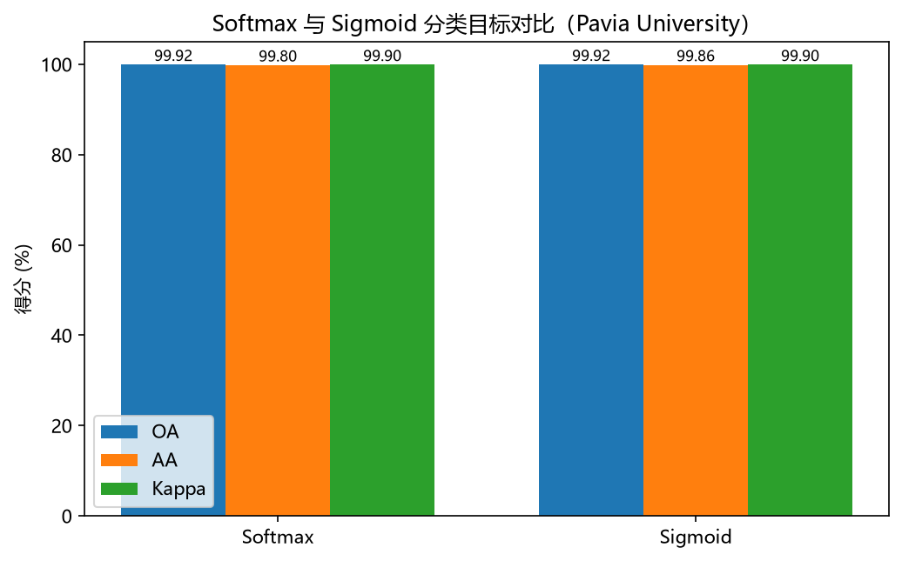

# 高光谱图像智能解译实验报告

> 基于混合 3D–2D 卷积网络 HybridSN 与多种传统分类方法的高光谱图像地物分类

---

## 1. 实验概述

### 1.1 任务目标

高光谱图像（Hyperspectral Image, HSI）在数十至数百个连续波段上记录地表反射率，蕴含丰富的光谱-空间信息，可用于精细的地物分类。本实验围绕三套公开高光谱数据集（**Pavia University、Indian Pines、Salinas**），完成以下工作：

1. 数据读取、构成分析与数据划分（训练/验证/测试 = 24%/6%/70%）；
2. 逐波段标准化与三种降维预处理（**PCA / LDA / 波段选择**）及原始（不降维）路线；
3. 构建并训练**可配置 HybridSN** 深度学习模型（softmax 与 sigmoid 两种分类目标）；
4. 对比 **SVM / KNN / LDA / 随机森林 / XGBoost** 等传统分类方法的性能。

### 1.2 评价指标

- **OA（Overall Accuracy）**：整体精度，即测试集上预测正确的比例；
- **AA（Average Accuracy）**：平均精度，即各类别精度的算术平均，对类别不平衡更敏感；
- **Kappa（Cohen's Kappa）**：一致性系数，衡量分类结果与真实标签的一致性（扣除随机一致性）。

### 1.3 运行环境

| 项目 | 说明 |
| --- | --- |
| 操作系统 | Windows 11 |
| 语言 | Python 3.12 |
| 深度学习框架 | PyTorch 2.12（CUDA） |
| 机器学习库 | scikit-learn 1.9、XGBoost 3.4 |
| 加速设备 | NVIDIA GeForce RTX 5070 Laptop GPU |

---

## 2. 数据集介绍

三套数据集均以 `.mat` 格式存储，包含影像立方体（H×W×B）与地物真值图（H×W）。下表给出其基本参数：

| 数据集 | 空间尺寸 | 波段数 | 类别数 | 标记像元数 |
| --- | --- | --- | --- | --- |
| Pavia University | 610 × 340 | 103 | 9 | 42,776 |
| Indian Pines | 145 × 145 | 200 | 16 | 10,249 |
| Salinas | 512 × 217 | 204 | 16 | 54,129 |

图 1 展示了 Pavia University 的假彩色合成图（取三个代表性波段作 RGB）与地物真值图。各类别样本数量分布如图 2 所示，可见存在明显的**类别不平衡**（如 Meadows 类样本最多、Shadows 类样本最少），这也是采用分层随机划分与平均精度 AA 的原因。

---

## 3. 数据预处理与划分

### 3.1 数据划分

为便于不同方法之间的公平对比，统一采用两层**分层随机划分**：

1. 先按 30% / 70% 划分出「训练池 / 测试集」；
2. 再从 30% 训练池按 80% / 20% 划分出「训练集 / 验证集」；
3. 最终得到 **训练 / 验证 / 测试 = 24% / 6% / 70%**。

| 数据集 | 训练 | 验证 | 测试 |
| --- | --- | --- | --- |
| Pavia University | 10,265 | 2,567 | 29,944 |
| Indian Pines | 2,459 | 615 | 7,175 |
| Salinas | 12,990 | 3,248 | 37,891 |

### 3.2 标准化与降维

预处理流程为「**逐波段标准化 → 降维**」，且**所有统计量只在训练集上拟合**，再变换整幅图像，避免测试集信息泄漏。降维方案包括：

- `raw`：原始波段（仅标准化）；
- `pca15`：主成分分析，保留 15 个主成分；
- `lda8`：线性判别分析（有监督，维度上限 = 类别数 − 1 = 8）；
- `uniform15` / `fisher15`：波段选择（等间隔均匀选取 / Fisher 判别得分排序选取 15 个波段）。

图 4 给出了 PCA 累计解释方差、PCA 前两主成分散点（按类别着色）与 Fisher 波段选择得分。后续模型统一采用 **PCA15** 路线（波段数 103 → 15）。

---

## 4. 模型与方法

### 4.1 HybridSN 网络结构

HybridSN 将 3D 卷积（同时提取光谱-空间特征）与 2D 卷积（高层空间特征）级联，末端接全连接分类器。本实验的模型以每个标记像元为中心的 **25×25 邻域 patch** 为输入（边缘补零），结构如图 5 所示：

- 输入 patch：`1 × 15 × 25 × 25`（1 通道、15 个 PCA 主成分波段）；
- **3D 卷积 ×3**：通道 8 → 16 → 32，光谱核 7 → 5 → 3，空间核 3×3；
- **Reshape**：将 `32 × 3 × 19 × 19` 展开为 `96 × 19 × 19`；
- **2D 卷积**：96 → 64 通道，3×3；
- **Flatten**：`64 × 17 × 17 = 18496`；
- **全连接分类器**：18496 → 256 → 128 → 9，Dropout 0.4。

模型结构通过 `configs/stage2_hybridsn/*.yaml` 配置，支持调整通道数、卷积核、全连接单元数、Dropout 等；展平维度由模型自动推导，改动结构后无需手动重算。

### 4.2 分类目标（softmax vs sigmoid）

- **softmax**：多类互斥，输出经 softmax 归一化，配合交叉熵损失 `CrossEntropyLoss`；
- **sigmoid**：一对多（one-vs-rest）多标签，逐类输出 sigmoid 概率，配合 `BCEWithLogitsLoss` 计算 one-hot 二分类损失。

### 4.3 传统分类方法

为与 HybridSN 公平对比，传统方法使用相同的 **PCA15 中心像元光谱特征**（每个像元为 15 维向量）与相同的划分，逐方法测试：

| 方法 | 关键超参数 |
| --- | --- |
| SVM | RBF 核，C=16，γ=scale |
| KNN | k=5，距离加权 |
| LDA | 线性判别分析（无额外超参数） |
| 随机森林 | 200 棵树，`max_features=sqrt` |
| XGBoost | 200 轮，max_depth=6，lr=0.05 |

---

## 5. 训练设置

| 超参数 | 取值 |
| --- | --- |
| 优化器 | Adam |
| 学习率 | 0.001 |
| 权重衰减 | 0.0 |
| 训练轮数 | 30 |
| 批大小 | 256 |
| 早停耐心 / 最小提升 | 12 轮 / 0.0 |
| patch 边长 | 25 |

训练采用**早停**策略：验证集准确率连续 12 轮无提升即停止，并保存在验证集上最优的模型权重用于测试评估。

---

## 6. 实验结果与分析

### 6.1 HybridSN 训练过程

Softmax 基线在验证集上约第 5 轮即达到 99.96% 的最优准确率，随后早停于第 17 轮，收敛迅速且稳定，训练/验证损失与准确率曲线如图 6 所示。

### 6.2 HybridSN 测试性能

在测试集上，Softmax 基线取得 **OA = 99.92%，AA = 99.80%，Kappa = 99.90%**。混淆矩阵（图 7）近乎对角，说明绝大多数像元被正确分类；各类别精度（图 8）均高于 99%，其中 Shadows（第 9 类）精度相对较低（约 99.1%），与其样本量少、易与暗色地物混淆有关。

### 6.3 softmax 与 sigmoid 对比

在相同模型结构与划分下，仅切换分类目标，结果如图 9 与下表所示：

| 分类目标 | OA | AA | Kappa |
| --- | --- | --- | --- |
| softmax | 99.92% | 99.80% | 99.90% |
| sigmoid | 99.92% | 99.86% | 99.90% |

两种分类目标在 Pavia University 上均取得约 99.9% 的高精度，sigmoid 的 AA 略高（99.86% vs 99.80%），表明一对多二分类目标在该任务上同样有效。

### 6.4 传统分类方法对比

| 方法 | OA | AA | Kappa |
| --- | --- | --- | --- |
| SVM | 93.50% | 91.25% | 91.34% |
| XGBoost | 93.04% | 90.23% | 90.72% |
| 随机森林 | 91.74% | 87.84% | 88.91% |
| KNN | 87.80% | 85.18% | 83.54% |
| LDA | 83.62% | 77.21% | 78.06% |

在传统方法中，**SVM（RBF）** 精度最高（OA 93.50%），其次为 XGBoost（93.04%）；线性方法 LDA 精度最低（83.62%），说明该数据在原始（PCA 后）光谱空间中的分类边界具有较强的非线性。

### 6.5 综合对比

将 HybridSN 与最优传统方法对比可知：**HybridSN（OA 99.92%）显著优于所有传统方法（最优 SVM 93.50%）**，OA 提升约 6.4 个百分点，Kappa 从 91.3% 提升至 99.9%。这一差距主要源于：

1. **空间上下文信息**：HybridSN 以 25×25 邻域 patch 为输入，通过 3D/2D 卷积显式建模光谱-空间联合特征，而传统方法仅使用单个中心像元的光谱向量，忽略了空间邻域的结构信息；
2. **非线性表征能力**：深度网络的多层非线性变换能够学到更复杂的判别特征，优于 SVM 等浅层/核方法。

---

## 7. 结论

本实验构建了一套完整的高光谱图像分类流程：数据读取与划分 → 标准化与降维预处理 → HybridSN 深度模型与传统方法对比评估。主要结论如下：

1. **HybridSN 性能卓越**：在 Pavia University 测试集上 OA/AA/Kappa 均达 99.9% 左右，远超传统方法，验证了 3D-2D 混合卷积在光谱-空间联合特征提取上的优势；
2. **softmax 与 sigmoid 均有效**：两种分类目标精度相当，sigmoid（一对多 BCE）在平均精度上略优；
3. **预处理无数据泄漏**：标准化与降维统计量仅在训练集拟合；
4. **传统方法中 SVM 最优**：RBF 核 SVM 达到 93.5% OA，可作为轻量级基线。

后续工作可在以下方向展开：① 引入注意力机制与更深的 3D 残差结构；② 在 Indian Pines、Salinas 上扩展实验；③ 结合 LBP/Gabor 等手工特征增强传统方法。

---

## 附：目录与运行说明

- 三个自包含 Notebook 位于 `notebooks/`，按编号顺序运行：
  1. `01_数据读取划分与预处理.ipynb`
  2. `02_HybridSN基线训练验证测试.ipynb`
  3. `03_传统分类方法对比.ipynb`
- 超参数集中在 `configs/` 各 YAML 文件，核心超参数均已加中文注释；
- 运行产物（模型就绪数据、checkpoint、指标与图）位于 `outputs/`，本报告插图位于 `figures/`。
